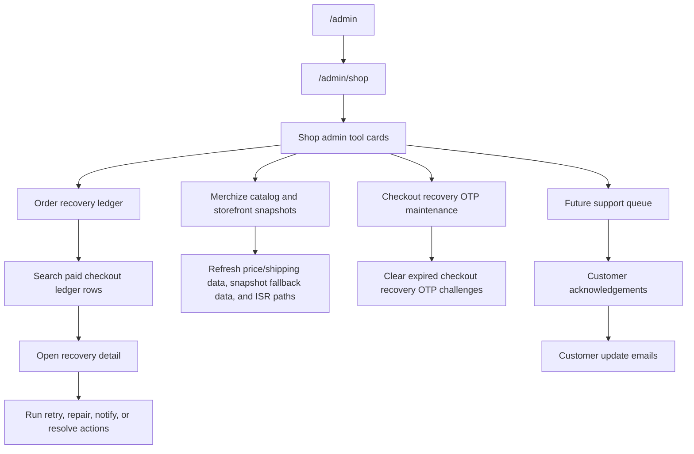
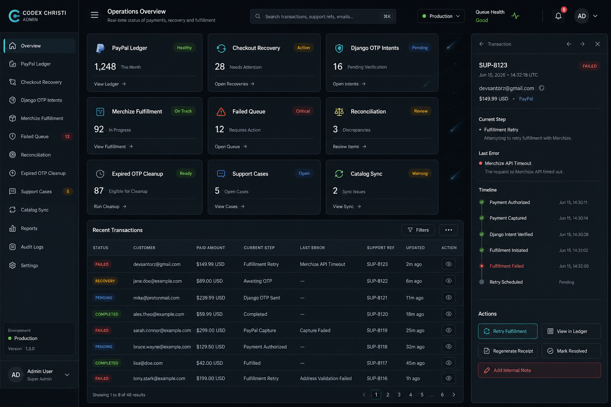
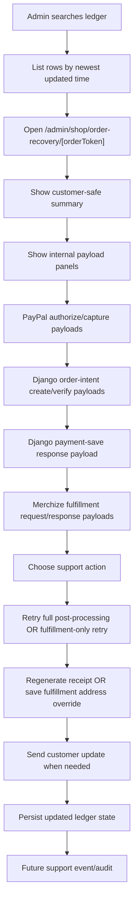
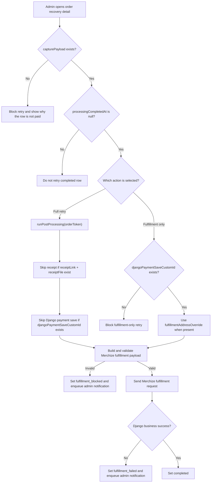

# Admin And Recovery Tooling Guide

Last updated: 2026-06-16

This guide isolates the admin and checkout recovery work from the broader PayPal TX ledger guide. Use it as the source of truth for the next implementation phase: admin visibility, support recovery, retry operations, and maintenance tooling.

Related source docs:

- `PAYPAL_TX_LEDGER_GUIDE.md`
- `CODEX_CHAT_HANDOFF_CHECKOUT_RECOVERY.md`

## Current Position

The checkout customer-side recovery flow exists. A paid but unresolved PayPal ledger row can be detected by email before a new Django order intent is created, then a Next.js-owned checkout recovery OTP proves email ownership.

The next major phase is admin and support tooling.

### Current Checkpoint: False-Success Fulfillment Handling

The runtime payment ledger now owns the false-success scenario where Django returns HTTP 2xx but the response body says fulfillment failed.

Implemented before the dashboard revamp continues:

- `success: false`, `processing_status: failed`, or `error_message` from Django/Merchize becomes `fulfillment_failed`, not `completed`.
- Local fulfillment payload validation failure becomes `fulfillment_blocked`.
- Request and response payloads are persisted on the ledger row for admin inspection.
- Automatic webhook/capture resume paths do not retry or roll these rows backward once they are in fulfillment recovery states.

Dashboard/admin work should continue from these states:

- Query and display `fulfillment_failed` and `fulfillment_blocked` rows.
- Show `lastErrorCode`, `lastErrorMessage`, `merchizeFulfillmentRequestPayload`, and `merchizeFulfillmentResponsePayload`.
- Add `AdminNotificationOutbox` persistence and email delivery as the next admin tooling step.
- Keep the payment state machine owned by the ledger runner; admin actions should call retry/override helpers instead of reinterpreting provider success.

## Core Problem

A real user can pay successfully, but post-payment processing can fail after PayPal capture. Example failure points:

- Receipt generation/upload fails.
- Django payment save fails.
- Merchize fulfillment push fails.
- A webhook arrives while local tunneling or the Next.js server is down.
- A retry runs with stale or missing ledger fields.
- A receipt was generated without item-level rows and must be regenerated.

The admin tooling must make these cases visible and recoverable without relying on the shopper's browser session.

## Naming Rules

Use names that say which system owns the value.

Preferred ledger fields:

- `orderToken`: local PayPal TX ledger support reference and durable checkout correlation token.
- `paypalOrderId`: PayPal order ID required by PayPal SDK/provider flows.
- PayPal `purchase_units[].custom_id`: mirrors `orderToken` for provider-webhook reconciliation. Do not label this as the Django payment-save custom ID.
- `paypalAuthorizationId`: PayPal authorization ID.
- `djangoOrderIntentUuid`: Django order-intent UUID.
- `djangoOrderIntentOrderId`: Django order-intent order string, originally used as the OTP order ID.
- `djangoOrderIntentPayload`: raw Django order-intent create response.
- `djangoOrderIntentVerifyPayload`: raw Django order-intent OTP verify response.
- `djangoPaymentSaveCustomId`: Django payment-save custom ID used as the `/orders/process/{custom_id}` path identifier.
- `djangoPaymentSaveResponsePayload`: raw Django payment-save response.
- `merchizeFulfillmentRequestPayload`: request payload sent to the Django process endpoint for Merchize fulfillment.
- `merchizeFulfillmentResponsePayload`: response payload from the Merchize fulfillment process.
- `merchizeFulfillmentProcessingId`: Django processing row ID from fulfillment response.
- `merchizeProviderOrderId`: provider order ID returned by Merchize/Django processing.
- `merchizeProviderOrderCode`: provider order code returned by Merchize/Django processing.
- `fulfillmentAddressOverride`: admin-provided fulfillment address used on retry.

Avoid:

- `backendIntent`
- `backendCustomId`
- `otpOrderId`
- `orderCustomId`
- `intentId` without a system prefix
- `fulfillmentResponse` without a provider prefix

## Route Map

Preferred admin routes:

```txt
/admin (reserved for the future cross-platform admin hub; currently 404)
/admin/shop
/admin/shop/order-recovery
/admin/shop/order-recovery/[orderToken]
/admin/shop/merchize-catalog-snapshots
```

Preferred API/action boundaries:

```txt
src/app/admin/shop/order-recovery/page.tsx
src/app/admin/shop/order-recovery/[orderToken]/page.tsx
src/app/admin/shop/order-recovery/actions.ts
src/app/admin/shop/order-recovery/AdminOrderRecoveryClient.tsx
src/lib/paypal/txLedger/adminLedgerQueries.ts
src/lib/paypal/txLedger/adminLedgerActions.ts
src/lib/utils/adminAuth.ts
```

Do not expose retry operations as unauthenticated public API routes. Prefer server actions or route handlers protected by the admin auth helper.

## Admin Route Flow



## Existing Data Sources

Primary table:

```txt
PaypalIntent
```

Useful fields for admin search:

- `orderToken`
- `paypalOrderId`
- `paypalAuthorizationId`
- `djangoOrderIntentUuid`
- `djangoOrderIntentOrderId`
- `djangoPaymentSaveCustomId`
- `customerEmail`
- `customerName`
- `status`
- `lastEventType`
- `lastErrorCode`
- `lastErrorMessage`
- `createdAt`
- `updatedAt`

Related table:

```txt
CheckoutRecoveryOtpChallenge
```

Useful fields:

- `email`
- `expiresAt`
- `consumedAt`
- `attemptCount`
- `createdAt`

Operational notification table:

```txt
AdminNotificationOutbox
```

Purpose:

- Drive configured admin email alerts for transaction recovery events.
- Create one row per configured recipient in `ORDER_RECOVERY_ADMIN_EMAILS`.
- Preserve notification delivery state separately from the order ledger state.
- Let admins see whether a valid event produced an email, whether it sent, and whether it needs resend.

Useful fields:

- `orderToken`
- `paypalOrderId`
- `type`
- `stage`
- `errorCode`
- `severity`
- `status`
- `dedupeKey`
- `recipient`
- `payload`
- `attemptCount`
- `lastAttemptAt`
- `sentAt`
- `lastErrorMessage`
- `createdAt`

## Ledger Status Semantics

Use current values from `src/lib/paypal/txLedger/status.ts`:

- `intent_creating`: local ledger row started before PayPal order creation finished.
- `intent_created`: PayPal order created and stored.
- `authorized`: PayPal authorization succeeded.
- `captured`: payment capture succeeded.
- `receipt_uploaded`: receipt was generated and uploaded.
- `payment_saved`: Django payment save succeeded; fulfillment may still be pending.
- `fulfillment_blocked`: local fulfillment payload validation failed before the provider call; admin repair is required.
- `fulfillment_failed`: Django/Merchize fulfillment returned a business failure after the HTTP request succeeded.
- `completed`: all post-processing completed.
- `pending`: generic waiting state.
- `refunded`: payment was refunded.
- `error`: post-processing failed or needs review.

Unresolved paid statuses for recovery:

```ts
[
  'captured',
  'receipt_uploaded',
  'payment_saved',
  'fulfillment_blocked',
  'fulfillment_failed',
  'error',
]
```

A customer-facing recovery warning should only be considered for rows that:

- Belong to the verified email.
- Have `processingCompletedAt: null`.
- Have a non-null `capturePayload`.
- Have `djangoOrderIntentOrderId`.
- Have `djangoOrderIntentVerifyPayload`.
- Are in an unresolved paid status.

## Admin Dashboard Scope

The broader admin dashboard should be a hub, not only a ledger page.

Initial shop-focused cards:

- Merchize Catalog & Snapshots.
- Order Recovery ledger.
- Clear expired checkout recovery OTP challenges.

Future cards:

- Customer support message queue.
- Manual order review.
- Product/catalog health checks.
- Fulfillment provider health.

## Admin Dashboard Visual System

The admin dashboard should feel like a polished operational command center, not a marketing page. It should use the existing Codex Christi dark visual language with more deliberate glass, glow, and motion rules.

Visual reference:



The dashboard shell should use:

- Existing `CometsContainer` as the background layer.
- A dark overlay above the comet field so text remains readable.
- Translucent graphite panels instead of flat black sections.
- Compact cards with clear metrics and one primary action.
- Subtle cyan, emerald, gold, and violet edge accents.
- Glowing borders only for selected, active, failed, or high-priority states.
- A recent failures table for fast scanning.
- Dedicated order recovery detail routes for focused repair work.

The background should support the interface without competing with it:

- Comets remain visible through the glass surfaces.
- The overlay should not become pitch black.
- The blur should be strong enough for contrast, but light enough to preserve site continuity.
- Background movement should stay CSS-based through `CometsContainer`.

Initial admin card groups:

- Order Recovery Ledger: search and repair paid checkout rows across payment and fulfillment providers.
- Checkout Recovery: review customer-facing recovery signals.
- Django Order Intent OTP: inspect Django order-intent create and verify state.
- Merchize Fulfillment: track provider push state and retry eligibility.
- Failed Processing Queue: surface rows that need manual attention.
- Reconciliation: compare PayPal, Django, Merchize, and local ledger state.
- Expired OTP Cleanup: clear expired checkout recovery OTP challenges.
- Support Cases: future customer support queue and customer updates.
- Catalog & Snapshots: refresh Merchize price/shipping data and storefront fallback snapshots.

Card content rules:

- Each card must represent a real operational route or action.
- Avoid decorative cards that do not take the admin somewhere useful.
- Keep card titles short.
- Use one concise purpose line.
- Include one status indicator when the data exists.
- Include one primary CTA such as "Open", "Review", "Retry", or "Clear".
- Use icons for recognition, but never rely on icons alone.

Recommended desktop layout:

- Left rail for admin sections.
- Top command bar for search, environment, queue health, and admin identity.
- Main card grid for operational entry points.
- Full-width order recovery queue for fast scanning.
- Dedicated order recovery detail page for timeline, provider state, payloads, and actions.
- Sticky action column inside the detail page when the action set becomes live.

Recommended mobile layout:

- Collapse the left rail into a top or drawer navigation.
- Convert cards into a single-column list.
- Keep primary CTAs visible without forcing long scrolling.
- Navigate from a queue row directly to the detail page.
- Keep dangerous actions behind confirmation dialogs.

## Order Recovery Ledger Page Scope

The first admin ledger page should be provider-neutral in route and UI language. The current data source can still be the PayPal transaction ledger with Django order-intent and Merchize fulfillment fields.

The first admin ledger page should support:

- Search by email.
- Search by support reference/order token.
- Search by PayPal order ID.
- Search by Django order-intent UUID.
- Search by Django order-intent order ID.
- Search by Django payment-save custom ID.
- Filter by ledger status.
- Filter by date range.
- Sort newest first by default.
- Paginate results.

Each result row should show:

- Support reference.
- Customer email.
- Paid amount if available.
- Current status.
- Current processing step.
- Last error code/message summary.
- Created date.
- Updated date.
- Primary action: View.
- Row and action navigation should open `/admin/shop/order-recovery/[orderToken]`.

## Ledger Recovery Flow



## Order Recovery Detail Page Scope

The detail view should be a dedicated route, not the primary right-hand sidebar experience. Use the right-hand sidebar pattern only as a future optional quick preview if there is a clear operational need.

The detail page should show both a compact support summary and deep debugging data.

Customer-safe summary:

- Support reference.
- Paid amount.
- Placed date.
- Cart item count and first few item names.
- Shipping city/state/country.
- Current processing step.
- Receipt link if available.

Internal debugging panels:

- Ledger identifiers.
- PayPal authorize payload.
- PayPal capture payload.
- Cart snapshot.
- Shipping snapshot.
- Django order-intent create payload.
- Django order-intent verify payload.
- Django payment-save response payload.
- Merchize fulfillment request payload.
- Merchize fulfillment response payload.
- Fulfillment validation issue list when present.
- Admin notification outbox history.
- Webhook/error metadata.
- Lock fields.
- Retry count.

Large JSON panels should be collapsed by default.

## Admin Actions

### Retry Full Post-Processing

Purpose:

- Resume the ledger-driven flow from the first incomplete step.

Rules:

- Only run against a paid row.
- Use `runPostProcessing(orderToken)` as the core operation.
- Do not rebuild required paid-order data from browser stores.
- Treat existing artifacts as step completion markers.
- Increment or record retry metadata.
- Show the new status and latest error after the retry.

Expected behavior:

- If receipt already exists, skip receipt generation.
- If `djangoPaymentSaveCustomId` already exists, skip Django payment save.
- If fulfillment has not completed, send fulfillment.
- If successful, set status to `completed`.
- If local fulfillment payload validation fails, set `fulfillment_blocked`, persist the attempted payload and local validation envelope, and enqueue an admin notification.
- If Django returns HTTP 2xx with `success: false`, `processing_status: failed`, or `error_message`, set `fulfillment_failed`, persist request/response payloads, and enqueue an admin notification.

### Retry Merchize Fulfillment Only

Purpose:

- Retry only the final fulfillment push when receipt and Django payment save are already complete.

Required row fields:

- `cartSnapshot`
- `djangoPaymentSaveCustomId`
- `initialCurrency`
- `customerName`
- `shippingSnapshot` or `fulfillmentAddressOverride`

Rules:

- Use `fulfillmentAddressOverride` when present.
- Rebuild the canonical fulfillment payload before sending.
- Normalize country to the provider/Django process contract (`US`, not `USA`).
- Validate required payload fields before sending.
- Save `merchizeFulfillmentRequestPayload`.
- Save `merchizeFulfillmentResponsePayload`.
- Save `merchizeFulfillmentProcessingId`, `merchizeProviderOrderId`, and `merchizeProviderOrderCode` when returned.
- Treat HTTP success as transport success only. Fulfillment succeeds only when the response body indicates business success.
- On validation/provider failure, keep the row unresolved and visible for repair/retry.

### Regenerate Receipt

Purpose:

- Repair receipts that were created without item rows or had upload issues.
- Replace a completed transaction receipt when the stored PDF is stale, malformed, or missing item-level detail.

Rules:

- Use `authorizePayload`, `cartSnapshot`, customer data, and `djangoOrderIntentOrderId ?? orderToken`.
- Do not depend only on PayPal item payloads because PayPal may not echo item-level data.
- Save the new `receiptLink` and `receiptFile`.
- Keep the old receipt reference visible in audit notes if audit storage exists later.
- Allow this action on `completed` rows, but require a confirmation dialog and an admin reason.
- Prefer uploading a new versioned R2 object instead of overwriting the existing object key.
- Use a filename suffix such as `-v2`, `-v3`, or a timestamp to avoid stale CDN/browser cache.
- Update the ledger row to point to the new `receiptLink` and `receiptFile` after upload succeeds.
- Keep the old receipt URL visible to admins until immutable audit storage exists.

Avoid direct same-key overwrites by default:

- Current receipt uploads use long public caching.
- A same-key overwrite may leave admins or customers seeing the old PDF from cache.
- A versioned key gives support a fresh URL and preserves traceability.

### Save Fulfillment Address Override

Purpose:

- Let support retry fulfillment with a corrected address after customer confirmation.

Fields:

- `fulfillmentAddressOverride`
- `fulfillmentAddressOverrideReason`
- `fulfillmentAddressOverriddenBy`
- `fulfillmentAddressOverriddenAt`

Rules:

- Require an explicit reason.
- Show original shipping snapshot beside the override.
- Do not mutate the original `shippingSnapshot`.
- Use the override only for fulfillment retries.

### Clear Stale Post-Processing Lock

Purpose:

- Release a stuck lease if a process died mid-operation.

Rules:

- Only clear when `postProcessingLockExpiresAt < new Date()`.
- Do not clear an active lock unless the admin confirms the risk.
- Show lock age before confirmation.

### Mark Manually Resolved

Purpose:

- Close a ledger row when support resolved it outside automation.

Rules:

- Require a note.
- Preserve all payloads and error history.
- Set `processingCompletedAt` only if the business process is genuinely complete.
- Prefer a future explicit resolution/audit table before this action becomes heavily used.

### Send Customer Update

Purpose:

- Notify the customer that support has seen or resolved the paid checkout issue.

Rules:

- Use the mailer abstraction, not raw provider calls from UI components.
- Use customer-safe language.
- Include support reference.
- Do not include raw provider payloads or internal error messages.

### Resend Or Suppress Admin Recovery Notification

Purpose:

- Manage internal alert delivery without rerunning payment or fulfillment work.

Rules:

- Operate on `AdminNotificationOutbox`, not the checkout ledger row directly.
- Allow resend only for failed or sent rows when an admin confirms.
- Allow suppress only with a reason.
- Never delete notification rows during normal support work.
- Preserve the link to the `orderToken` and failure payload.

### Clear Expired Checkout Recovery OTP Challenges

Purpose:

- Remove expired recovery OTP rows and prevent OTP buildup.

## Retry Decision Flow



Immediate deletion:

```ts
await paypalTxLedger.checkoutRecoveryOtpChallenge.deleteMany({
  where: {
    expiresAt: {
      lt: new Date(),
    },
  },
});
```

Safer deletion with a debugging buffer:

```ts
await paypalTxLedger.checkoutRecoveryOtpChallenge.deleteMany({
  where: {
    expiresAt: {
      lt: new Date(Date.now() - 24 * 60 * 60_000),
    },
  },
});
```

Default recommendation:

- Use the safer 24-hour buffer in admin UI.
- Show the number of rows deleted.

## Future Customer Acknowledgement Tracking

The customer recovery modal has a placeholder "Notify support" direction. The future admin system should track that signal.

Possible future table:

```txt
CheckoutRecoveryCustomerEvent
```

Possible fields:

- `id`
- `email`
- `orderToken`
- `eventType`
- `eventPayload`
- `createdAt`

Initial event types:

- `recovery_prompt_shown`
- `ownership_verified`
- `notify_support_clicked`
- `new_order_acknowledged`
- `support_update_sent`

This is not required before admin retry works, but the guide should keep the path open.

## Future Cart Fingerprint Comparison

Optional future improvement:

- Send a compact current-cart fingerprint during checkout recovery.
- Compare it against unresolved ledger `cartSnapshot`.
- Classify as `same`, `different`, or `unknown`.

This should only tune copy and severity. It should not hide a verified unresolved paid checkout.

Example labels:

- Same cart: "This looks like the same checkout."
- Different cart: "This appears to be a separate order, but an earlier paid checkout still needs support review."
- Unknown cart: "We found a paid checkout that still needs support review."

## Implementation Order

### Phase 1: Admin Auth Foundation

Create or standardize:

```txt
src/lib/utils/adminAuth.ts
```

Minimum behavior:

- Read `x-admin-secret` for route handlers or use the current cookie pattern for admin pages.
- Fail closed when the environment secret is missing.
- Return `401` for missing/invalid secrets.

Decision:

- Do not keep separate page-local password gates for individual admin tools.
- The Merchize Catalog & Snapshots route should rely on the future central admin auth boundary.
- Do not block the ledger UI on a full identity provider during beta.
- Treat any temporary shared-secret or shared-cookie pattern as a beta bridge only.
- Plan to consolidate admin auth around cryptographic identity.

Production target:

- Use WebAuthn/passkeys for admin login.
- Use opaque server-side sessions after login.
- Require fresh WebAuthn step-up for dangerous actions.
- Store admin session state server-side, not in browser local storage.
- Do not use email OTP as the primary admin login method.

Recommended future tables:

```txt
AdminUser
AdminPasskeyCredential
AdminSession
AdminRecoveryCode
AdminAuditEvent
```

Recommended admin session cookie:

```txt
__Host-admin_session
HttpOnly
Secure
SameSite=Strict
Path=/
```

Session rules:

- Store only a hashed session token in the database.
- Rotate or revoke sessions when admin credentials change.
- Expire sessions automatically.
- Keep recovery codes single-use and store only hashed code values.

Step-up auth should be required for:

- Retry full post-processing.
- Retry Merchize fulfillment.
- Regenerate receipt.
- Save fulfillment address override.
- Mark manually resolved.
- Refund, dispute, or cancellation actions when added.
- Admin role or credential changes.

### Phase 2: Admin Hub

Create:

```txt
src/app/admin/page.tsx
src/app/admin/shop/page.tsx
```

Hub cards:

- Merchize Catalog & Snapshots
- Order Recovery Ledger
- Checkout Recovery OTP Maintenance

Hub cards should include:

- Name.
- One-line purpose.
- Status indicator.
- Last updated or last run if available.
- One primary link.

### Phase 3: Ledger Query Layer

Create:

```txt
src/lib/paypal/txLedger/adminLedgerQueries.ts
```

Functions:

- `searchAdminLedgerRows`
- `getAdminLedgerDetail`
- `getCheckoutRecoveryOtpActivityForEmail`

Rules:

- Keep Prisma calls server-only.
- Select only fields needed for the list view.
- Fetch full JSON payloads only for the detail view.
- Default to `take: 25` for table pages.

### Phase 3A: Admin Notification Outbox

Create:

```txt
src/lib/paypal/txLedger/adminNotificationOutbox.ts
```

Functions:

- `enqueueAdminRecoveryNotification`
- `listAdminNotificationsForOrder`
- `sendPendingAdminRecoveryNotifications`
- `resendAdminRecoveryNotification`
- `suppressAdminRecoveryNotification`

Rules:

- Insert the outbox row in the same transaction that marks a paid row `fulfillment_blocked` or `fulfillment_failed`.
- For any valid transaction alert event, create one outbox row per configured recipient in `ORDER_RECOVERY_ADMIN_EMAILS`.
- Use deterministic `dedupeKey` values so webhook retries and admin retries do not spam support.
- Email sending can happen immediately after commit or from a scheduled worker, but the outbox row must exist first.
- A mailer failure must not hide the ledger recovery state.
- The notification payload should include the order token, error code, concise issue list, and admin detail link.

### Phase 4: Ledger UI

Create:

```txt
src/app/admin/shop/order-recovery/page.tsx
src/app/admin/shop/order-recovery/[orderToken]/page.tsx
src/app/admin/shop/order-recovery/AdminOrderRecoveryClient.tsx
```

UI sections:

- Search/filter bar.
- Status summary strip.
- Paginated table.
- Row and action links to the dedicated detail route.
- Detail route with overview, timeline, payload sections, and action zone.
- Notification history for validation/provider failures.

Default table columns:

- Status.
- Customer.
- Paid amount.
- Current step.
- Last error.
- Support reference.
- Updated.
- Actions.

### Phase 5: Admin Actions

Create:

```txt
src/app/admin/shop/order-recovery/actions.ts
src/lib/paypal/txLedger/adminLedgerActions.ts
```

Actions:

- `retryFullPostProcessingAction`
- `retryMerchizeFulfillmentAction`
- `regenerateReceiptAction`
- `saveFulfillmentAddressOverrideAction`
- `resendAdminRecoveryNotificationAction`
- `suppressAdminRecoveryNotificationAction`
- `clearStalePostProcessingLockAction`
- `markLedgerRowManuallyResolvedAction`
- `sendCustomerCheckoutUpdateAction`
- `clearExpiredCheckoutRecoveryOtpChallengesAction`

Rules:

- Every mutating action should return `{ ok: true, data }` or `{ ok: false, message }`.
- Every action should re-fetch the updated row or return enough data for the UI to refresh.
- Destructive or irreversible actions need confirmation dialogs.
- Retry actions must preserve structured validation/provider errors on failure and must not overwrite them with only a generic exception message.
- Fulfillment retry actions must run local payload validation and Django business-success checks before marking a row completed.

### Phase 6: Maintenance And Audit

Add:

- Expired OTP cleanup.
- Retry count display.
- Lock age display.
- Notification outbox status display.
- Customer acknowledgement/event display when implemented.
- Optional audit table before support workflows become multi-person.

### Phase 7: Production Hardening

Before production admin use:

- Replace shared password/cookie with real admin identity.
- Add audit logging for all mutating actions.
- Add role gating for high-risk actions.
- Add rate limits to retry and email actions.
- Make mailer failures visible without blocking ledger recovery.

## Post-Beta Production Scope Backlog

This section lists the larger production-grade scopes that are not required for the first beta recovery dashboard, but will matter once real support workflows, multiple admins, higher order volume, refunds, disputes, and compliance needs enter the system.

The beta target is to recover paid orders safely. The post-beta target is to make the whole paid-order operation observable, auditable, supportable, and resilient.

### 1. Admin Identity And Access Control

Post-beta admin access should move away from shared passwords and one-off cookies.

Required capabilities:

- Named admin accounts.
- Role-based access control.
- Multi-factor authentication for privileged users.
- Session expiry and session revocation.
- Password reset or identity-provider based login.
- Permission boundaries between view-only support, order recovery, refund/dispute operations, and engineering/debug access.
- Optional IP allowlisting or device trust for high-risk actions.

Suggested roles:

- `support_viewer`: can search orders and view customer-safe summaries.
- `support_operator`: can send customer updates and add support notes.
- `order_recovery_operator`: can retry post-processing, retry fulfillment, regenerate receipts, and save fulfillment address overrides.
- `finance_operator`: can view payment details, refund state, disputes, and chargebacks.
- `admin_manager`: can manage users, roles, and access.
- `engineer_admin`: can inspect raw payloads and technical diagnostics.

Open decision:

- Choose whether admin auth is custom, NextAuth/Auth.js, Clerk, Auth0, Supabase Auth, or another provider.

### 2. Immutable Audit Logging

Every sensitive admin action should leave a durable audit trail.

Audit records should capture:

- Actor ID.
- Actor email.
- Action type.
- Target entity type.
- Target entity ID.
- Before value for changed fields when reasonable.
- After value for changed fields when reasonable.
- Human reason or support note.
- IP address.
- User agent.
- Request ID or trace ID.
- Timestamp.

High-priority audited actions:

- Retry full post-processing.
- Retry fulfillment only.
- Regenerate receipt.
- Save fulfillment address override.
- Clear stale lock.
- Mark manually resolved.
- Send customer update.
- Clear expired OTP challenges.
- Refund or cancellation actions when those exist.
- Raw payload access if payloads contain sensitive customer or provider data.

Suggested future table:

```txt
AdminAuditEvent
```

This should be append-only. Admin UI should not expose a delete action for audit records.

### 3. Support Case Management

Ledger recovery rows are not the same thing as support cases. A customer issue can involve more than one ledger row, multiple emails, manual provider checks, and several internal notes.

Future support case capabilities:

- Create support case from a ledger row.
- Assign case to an admin user.
- Set case status.
- Set priority.
- Add internal notes.
- Add customer-visible notes.
- Link related ledger rows.
- Link related PayPal IDs.
- Link related Django identifiers.
- Link related Merchize provider order IDs.
- Track customer acknowledgement events.
- Track customer update emails sent.
- Add resolution summary.

Suggested statuses:

- `open`
- `waiting_on_support`
- `waiting_on_customer`
- `waiting_on_provider`
- `resolved`
- `closed`

Suggested future tables:

```txt
SupportCase
SupportCaseNote
SupportCaseLedgerLink
```

Open decision:

- Decide whether support cases are built in this app or delegated to a support platform later.

### 4. Background Jobs And Scheduled Recovery

Manual retry buttons are enough for beta. Post-beta should not rely only on a human opening the dashboard.

Required capabilities:

- Background job queue.
- Scheduled retry jobs.
- Dead-letter queue for repeated failures.
- Exponential backoff.
- Retry attempt history.
- Stale job detection.
- Job cancellation.
- Job lock visibility.
- Job result payloads.

Jobs to consider:

- Resume paid rows stuck in `captured`.
- Resume paid rows stuck in `receipt_uploaded`.
- Resume paid rows stuck in `payment_saved`.
- Retry fulfillment after provider timeout.
- Clear expired checkout recovery OTP challenges.
- Detect stale post-processing locks.
- Reconcile PayPal captures against ledger rows.
- Reconcile Django payment saves against ledger rows.
- Reconcile Merchize fulfillment responses against ledger rows.

Open decision:

- Choose the job runtime. Options include Vercel cron plus server actions, a dedicated worker process, BullMQ/Redis, Inngest, Trigger.dev, Cloudflare Queues, or a simple Postgres-backed job table.

### 5. Provider Reconciliation

Webhook-based systems need reconciliation because webhooks can be delayed, duplicated, dropped, or received while infrastructure is down.

PayPal reconciliation should detect:

- PayPal order exists but ledger row is missing.
- Capture succeeded but ledger status is not updated.
- Ledger row says captured but PayPal says refunded.
- PayPal dispute or chargeback exists.
- Webhook event was received but not processed.
- Webhook event was processed but post-processing failed.

Django backend reconciliation should detect:

- Django order intent exists but local ledger does not contain the identifier.
- Django OTP verification completed but local ledger does not reflect it.
- Django payment save custom ID exists but local ledger field is missing.
- Django process endpoint produced a fulfillment processing row but local ledger is missing the response.

Merchize reconciliation should detect:

- Fulfillment request was sent but no provider order ID/code was stored.
- Provider order exists but local ledger is not completed.
- Provider order failed or was cancelled after local success.
- Provider order requires address correction.

Suggested UI:

- Reconciliation health card.
- Last reconciliation run.
- Unmatched provider records.
- Rows requiring manual review.
- Re-run reconciliation action.

### 6. Refunds, Cancellations, Disputes, And Chargebacks

The beta recovery scope focuses on successful paid orders that failed after capture. Post-beta must cover negative payment outcomes.

Required capabilities:

- View refund state.
- View dispute state.
- View chargeback state.
- Link PayPal dispute IDs to ledger rows.
- Record partial refunds.
- Record full refunds.
- Prevent fulfillment retry after refund when appropriate.
- Show cancellation state from fulfillment provider.
- Record manual refund notes.
- Notify customer after refund or cancellation.

Important safety rules:

- A refunded row should not be retried for fulfillment without explicit override.
- A disputed row should be clearly marked before support takes action.
- A chargeback row should be visible to finance/admin roles, not every support role.

Suggested future fields or tables:

```txt
PaymentRefundEvent
PaymentDisputeEvent
PaymentChargebackEvent
```

### 7. Notification And Messaging System

The first version can send simple customer update emails. Internal recovery alerts must already be records, not fire-and-forget side effects, because they are part of paid-order recovery.

Beta requirement:

- Use `AdminNotificationOutbox` for internal admin alerts.
- Configure recipients with `ORDER_RECOVERY_ADMIN_EMAILS`.
- Create one outbox row per configured recipient for each valid alert event.
- Create outbox rows when fulfillment payload validation blocks an order.
- Create outbox rows when Django/Merchize returns transport success but business failure.
- Create outbox rows for failed transaction stages, including PayPal create-order, authorize, capture, receipt upload, Django payment save, and post-processing failures.
- Create outbox rows when scheduled/recovery checks find paid rows stuck beyond the configured recovery window.
- Show notification delivery status on the order recovery detail page.
- Allow resend/suppress actions with admin confirmation and reason capture.

Post-beta should extend this model to customer-facing notification records.

Required capabilities:

- Email template registry.
- Customer-safe message templates.
- Internal support alert templates.
- Delivery status tracking.
- Provider response tracking.
- Retry failed email delivery.
- Preview email before sending.
- Attach support reference.
- Link sent emails to ledger row and support case.

Events that may trigger notifications:

- PayPal order creation failed after a ledger row exists.
- PayPal authorization failed or returned an unusable payload.
- PayPal capture failed, was denied, or returned an ambiguous state needing review.
- Receipt upload failed.
- Django payment save failed.
- Local fulfillment payload validation blocked a paid order.
- Django/Merchize returned HTTP success but business failure, such as `success: false`, `processing_status: failed`, or `error_message`.
- Admin retry failed.
- Admin retry recovered a previously unresolved paid row.
- A captured row remains unresolved beyond the configured recovery window.
- Customer clicks "Notify support".
- Admin sends update.
- Order recovery succeeds.
- Fulfillment is retried.
- Fulfillment fails again.
- Refund is issued.
- Address confirmation is needed.
- Support case is resolved.

Email content rules:

- Include support reference, order token, PayPal order ID when available, stage, error code, current status, concise message, and admin detail link.
- Redact PII-heavy fields in email.
- Do not include full raw PayPal, Django, or Merchize payloads in email.
- Link admins to the order recovery detail page for full payload inspection.

Suggested future table:

```txt
CustomerNotificationEvent
```

### 8. Privacy, PII, And Data Retention

The ledger contains customer emails, names, addresses, provider payloads, and order details. Post-beta needs explicit privacy handling.

Required capabilities:

- PII field classification.
- Raw payload access restrictions.
- Redacted list views by default.
- Redacted logs.
- Data retention policy.
- Payload pruning policy if provider payloads become too sensitive or too large.
- Export support packet without exposing unnecessary internal data.
- Customer data deletion or anonymization strategy where legally required.

Open decision:

- Decide how long to retain raw PayPal, Django, and Merchize payloads.

### 9. Observability And Alerting

Post-beta operations need visibility beyond the admin page.

Required capabilities:

- Structured server logs.
- Correlation IDs across PayPal, Django, Merchize, and Prisma ledger operations.
- Metrics for recovery pipeline health.
- Alerting when failure rates exceed thresholds.
- Alerting when paid rows remain unresolved for too long.
- Alerting when webhook verification fails repeatedly.
- Alerting when email sending fails repeatedly.
- Alerting when provider APIs degrade.

Useful metrics:

- Paid rows created per day.
- Rows stuck in each status.
- Average time from capture to completed.
- Retry success rate.
- Fulfillment failure rate.
- Receipt regeneration count.
- Recovery OTP start and verify rates.
- Customer "notify support" clicks.

### 10. Reporting And Business Dashboards

The recovery admin page is operational. Post-beta should add reporting views for business and support review.

Useful reports:

- Failed paid orders by date range.
- Recovered paid orders by date range.
- Unresolved paid order aging.
- Average support resolution time.
- Top failure reasons.
- Fulfillment provider failure rate.
- Receipt regeneration rate.
- Refund/dispute/chargeback volume.
- Admin action volume.
- Customer notification volume.

Export options:

- CSV export for filtered ledger rows.
- CSV export for support cases.
- CSV export for audit events.
- PDF support packet for a single order.

### 11. Environment Safety Controls

Admin operations should make it difficult to mutate production accidentally.

Required capabilities:

- Visible environment banner.
- Clear sandbox vs production labels.
- Disable destructive production actions unless the admin confirms.
- Require stronger confirmation for production retries, refunds, and manual resolution.
- Separate dev/staging/prod credentials.
- Prevent staging admin from mutating production ledger.

Recommended confirmation text:

- Include `orderToken`.
- Include customer email.
- Include current status.
- Include target action.
- Require a reason for high-risk actions.

### 12. Database And Schema Hardening

The current ledger schema can support beta recovery, but post-beta will likely need additional tables rather than adding every concept to `PaypalIntent`.

Likely future tables:

```txt
AdminAuditEvent
SupportCase
SupportCaseNote
SupportCaseLedgerLink
PostProcessingJob
PostProcessingAttempt
CustomerNotificationEvent
CheckoutRecoveryCustomerEvent
PaymentRefundEvent
PaymentDisputeEvent
ProviderReconciliationRun
ProviderReconciliationIssue
```

Indexing needs:

- Search by customer email.
- Search by support reference.
- Search by provider IDs.
- Search by status and updated date.
- Search unresolved paid rows by age.
- Search audit events by actor and target entity.
- Search support cases by status and assignee.

### 13. Testing And Quality Gates

Post-beta requires tests around money, retries, and admin permissions.

Required test categories:

- Admin auth tests.
- Role permission tests.
- Ledger search tests.
- Ledger detail visibility tests.
- Retry idempotency tests.
- Fulfillment-only retry guard tests.
- Fulfillment payload validation tests.
- Django HTTP 200 with business failure tests.
- Admin notification outbox dedupe/resend/suppress tests.
- Receipt regeneration tests.
- Address override tests.
- Stale lock clearing tests.
- Expired OTP cleanup tests.
- Customer notification tests.
- Audit log tests.
- Webhook replay tests.
- Provider reconciliation tests.

Seed scenarios:

- Captured but no receipt.
- Receipt uploaded but payment save missing.
- Payment saved but fulfillment missing.
- Fulfillment blocked by invalid local payload.
- Fulfillment failed with structured Django error.
- Django returned HTTP 200 with `success: false`.
- Admin notification send failed after outbox row was created.
- Missing `djangoPaymentSaveCustomId`.
- Stale lock.
- Bad receipt with missing item rows.
- Refunded paid row.
- Disputed paid row.
- Multiple unresolved paid rows for one email.

### 14. Runbooks And Manual Operations

Post-beta support should have written runbooks, not only code.

Required runbooks:

- Paid order stuck after capture.
- Webhook was down or delayed.
- Fulfillment failed.
- Fulfillment blocked before provider call.
- Django returned HTTP success but business failure.
- Receipt is missing item rows.
- Customer entered wrong address.
- Customer asks for refund.
- PayPal dispute appears.
- Django backend is unavailable.
- Merchize API is unavailable.
- Admin retry fails repeatedly.

Each runbook should include:

- Symptoms.
- Where to search.
- What fields to inspect.
- Safe actions.
- Actions that require manager approval.
- Customer message template.
- Escalation path.

## Motion And Transition Rules

Motion should make the admin dashboard feel responsive and alive without slowing down operational work.

Use existing `framer-motion` for:

- Card entrance.
- Card hover lift.
- Selected-card expansion.
- Detail route transition.
- Row focus transitions.
- Optimistic action feedback.
- Confirmation dialog entrance and exit.

Keep background movement CSS-based:

- `CometsContainer` owns the comet field.
- Do not add a second background animation system.
- Do not add a canvas background unless a future performance test justifies it.

Route and view transitions:

- Browser or Next.js view transitions may be used as progressive polish.
- Core navigation must still work without view transition support.
- Prefer `framer-motion` for dashboard-local card, table, and detail-route transitions.
- Keep route transitions short and directional so admins do not wait on animation.

Animation limits:

- No new heavy animation dependency is needed.
- No distracting looping panel animation.
- No moving effect inside dense tables.
- Shimmer should be reserved for loading skeletons.
- Glow should be reserved for active, failed, selected, or high-priority states.
- Hover movement should be subtle and should not shift surrounding layout.

Accessibility and performance:

- Respect `motion-reduce` on every animation.
- Keep animations transform/opacity based where possible.
- Avoid animating blur intensity during frequent interactions.
- Keep the dashboard readable while the comet overlay is moving.
- The page should remain usable before all metrics finish loading.

## UI Style Guide

Admin tools are operational interfaces. They should be polished, but dense and scannable.

### Overall Theme

Use the current Codex Christi dark theme:

- Dark slate/near-black base.
- Emerald, cyan, or violet accents in small amounts.
- Glass panels with translucent backgrounds.
- Soft borders, not heavy outlines.
- Subtle glow only around active or important elements.

Avoid:

- Pitch-black full-screen backdrops.
- Marketing hero sections.
- Oversized decorative cards.
- Long paragraphs in operational panels.
- Huge gradient blobs.
- Nested cards inside cards.

### Layout

Desktop:

- Use a centered max-width shell for the admin hub.
- Use wider layouts for ledger tables.
- Keep filters sticky or easy to reach.
- Prefer split layout on the detail route: summary left/top, action panel right/bottom.

Mobile:

- Table should collapse into row cards.
- Action buttons should be sticky at the bottom of long detail views when possible.
- JSON panels should remain collapsed.
- Text should wrap naturally without shrinking below readable size.

### Surfaces

Use:

- Page background: `bg-slate-950` or a subtle existing site background wrapper.
- Main shell: `bg-slate-900/70 border border-slate-800 backdrop-blur-md`.
- Repeated rows/cards: `bg-slate-950/50 border border-slate-800`.
- Detail panels: un-nested sections with clear dividers.

Radii:

- Outer modal or page shell can follow the current site pattern.
- Repeated item cards should stay tighter, usually `rounded-lg`.
- Buttons and inputs should use `rounded-md` or `rounded-lg`.

### Typography

Use concise labels:

- "Retry"
- "Fulfill"
- "Receipt"
- "Override"
- "Resolve"
- "Notify"
- "Clear OTPs"

Avoid wordy CTAs:

- "Continue to manually re-run the order process"
- "Click here to tell customer support"

Use monospace only for identifiers:

- `orderToken`
- `paypalOrderId`
- `djangoPaymentSaveCustomId`

### Status Colors

Recommended mapping:

- `completed`: emerald.
- `payment_saved`: cyan.
- `receipt_uploaded`: sky.
- `captured`: amber.
- `authorized`: violet.
- `error`: rose.
- `refunded`: slate.
- `pending` or unknown: slate.

Status badges should include both color and text. Do not rely on color alone.

### Action Hierarchy

Primary actions:

- Retry
- View
- Notify

Secondary actions:

- Regenerate receipt.
- Save override.
- Clear stale lock.

Danger actions:

- Mark manually resolved.
- Clear OTPs.

Danger actions need confirmation and explanatory copy.

### Confirmation Dialogs

Use confirmation dialogs for:

- Retry full post-processing.
- Retry fulfillment only.
- Regenerate receipt.
- Clear lock.
- Mark manually resolved.
- Clear expired OTPs.

Dialog copy should answer:

- What will happen?
- What row is affected?
- What prerequisite was checked?
- What happens if it fails?

### Error Display

Show friendly top-level summaries first:

- "Fulfillment push failed."
- "Receipt regeneration failed."
- "Django payment save custom ID is missing."

Then show technical details in a collapsed section:

- `lastErrorCode`
- `lastErrorMessage`
- failed payload section
- latest webhook event

Never show only "This field is required." without the field name when structured error details exist.

### JSON Display

Large JSON payloads should:

- Be collapsed by default.
- Use monospace text.
- Preserve formatting.
- Be copyable.
- Avoid expanding inside table rows.

### Empty States

Use direct empty states:

- "No unresolved paid checkouts found."
- "No checkout recovery OTP activity for this email."
- "No stale locks found."

Avoid implying success when the query simply found no rows.

## Safety Invariants

Do not violate these during implementation:

- PayPal capture is the money boundary. After capture, the ledger is the source of truth.
- The shopper's browser should never be required to finish a paid order.
- Admin retry should reuse ledger payloads and saved identifiers.
- Retrying must be idempotent at the step level.
- Fulfillment should not run without `djangoPaymentSaveCustomId`.
- HTTP 2xx from Django is never enough to mark fulfillment complete; inspect the response body.
- Local fulfillment validation failures must become ledger rows plus outbox notifications, not only thrown exceptions.
- Provider business failures must preserve request/response payloads for admin review.
- Address overrides should never erase the original shipping snapshot.
- Customer-facing messages should not expose provider internals.
- Admin pages should never be publicly writable.

## Verification Commands

Generate the PayPal ledger Prisma client for dev:

```bash
yarn prisma:paypalTxLedger:generate:dev
```

Run dev migration:

```bash
yarn prisma:paypalTxLedger:migrate:dev
```

Create a demo unresolved paid checkout:

```bash
yarn paypal-ledger:recovery-demo:create demo@example.com
```

List demo rows for an email:

```bash
yarn paypal-ledger:recovery-demo:list demo@example.com
```

Clean demo rows for one email:

```bash
yarn paypal-ledger:recovery-demo:cleanup demo@example.com
```

Clean all demo recovery rows:

```bash
yarn paypal-ledger:recovery-demo:cleanup-all
```

Run type and lint checks:

```bash
npx tsc --noEmit --pretty false
yarn lint
```

## Acceptance Checklist

Admin hub:

- Links to Merchize Catalog & Snapshots admin.
- Links to Order Recovery ledger.
- Includes expired checkout recovery OTP cleanup entry.

Ledger list:

- Searches all required identifiers.
- Filters by status.
- Shows newest rows first.
- Does not fetch large JSON payloads for every row.

Ledger detail:

- Shows customer-safe summary.
- Shows internal payloads in collapsed panels.
- Shows current lock and retry state.
- Shows recovery OTP activity for the email.

Actions:

- Full retry works from `captured`, `receipt_uploaded`, `payment_saved`, and `error`.
- Fulfillment-only retry requires `djangoPaymentSaveCustomId`.
- Receipt regeneration uses `cartSnapshot` fallback.
- Address override is saved separately from `shippingSnapshot`.
- Expired OTP cleanup reports deleted count.

UX:

- Dark glass theme matches existing checkout/admin surfaces.
- Admin hub uses the `CometsContainer` glass/comet visual system.
- Cards are operational links or actions, not decorative blocks.
- Dashboard text remains readable with the comet overlay visible.
- Reduced-motion mode disables nonessential motion.
- No pitch-black isolated backdrop.
- CTAs are short and clear.
- Long content is collapsible.
- Mobile view keeps action buttons reachable.

Security:

- Mutating actions are admin-protected.
- Production high-risk actions require fresh WebAuthn step-up.
- Customer emails and payloads are not exposed outside admin.
- Raw errors are available to admin, but customer-safe copy is used for customer messages.

## Next Step

Start with Phase 1 and Phase 2:

1. Standardize admin auth expectations.
2. Create the admin hub.
3. Link the existing Merchize Catalog & Snapshots tool.
4. Add the Order Recovery ledger entry.
5. Add the expired checkout recovery OTP cleanup entry.

After that, build the ledger list/detail before adding retry actions.
