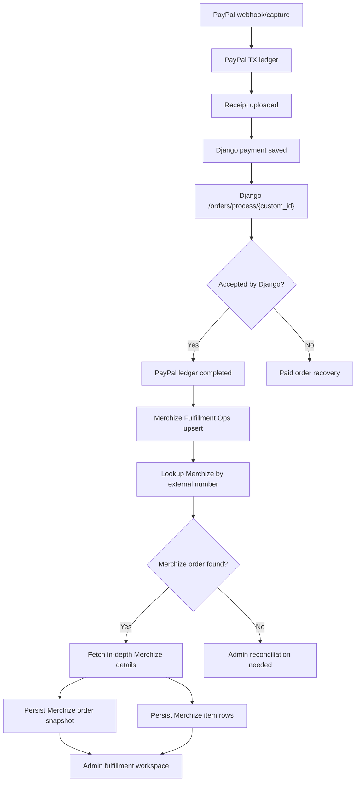
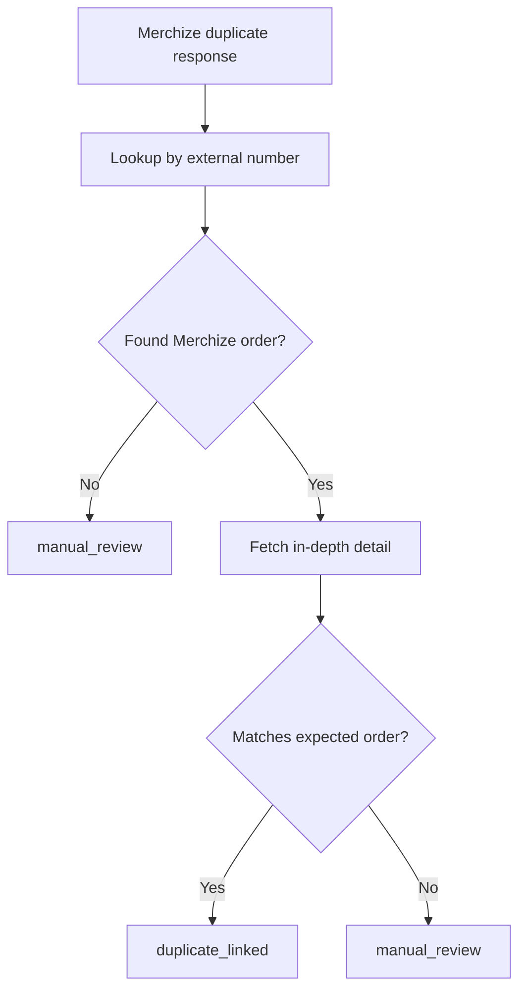

# Merchize Fulfillment Ops Guide

Last updated: 2026-06-17

This guide defines the post-fulfillment-push operations layer for Codex Christi shop orders. It is intentionally separate from the PayPal transaction ledger guide and the admin recovery tooling guide.

The short version:

- The PayPal TX ledger answers: "Was the paid checkout safely captured, saved, receipted, and handed off to fulfillment?"
- The Merchize Fulfillment Ops layer answers: "What happened after Merchize received or should have received the order?"

This guide is intentionally Merchize-specific. Other POD suppliers can get their own ops guide later after this flow is stable.

Related source docs:

- `PAYPAL_TX_LEDGER_GUIDE.md`
- `ADMIN_RECOVERY_TOOLING_GUIDE.md`
- `PAYPAL_WEBHOOK_REGISTRATION_AND_RECOVERY_GUIDE.md`

---

# 1) Scope Boundary

## Starts here

Merchize Fulfillment Ops starts after the Django backend accepts the fulfillment push:

```txt
POST /orders/process/{custom_id}
```

In current Django language, `{custom_id}` is the Django payment-save custom ID returned by:

```txt
POST /orders/order-payment
```

The local codebase names this value:

```txt
djangoPaymentSaveCustomId
```

## Does not own

Merchize Fulfillment Ops does not own these earlier checkout responsibilities:

- Checkout form state.
- Django order-intent OTP creation or verification.
- PayPal order creation.
- PayPal authorization or capture.
- PayPal webhook verification.
- Receipt PDF generation.
- Receipt PDF upload to R2.
- Django payment save.
- Customer-side unresolved paid checkout warning.

Those remain owned by the PayPal TX ledger and checkout recovery flows.

## Owns

Merchize Fulfillment Ops owns the Merchize lifecycle after Django accepted or attempted the fulfillment handoff:

- Merchize lookup by external number.
- Merchize order ID extraction.
- In-depth Merchize order detail fetch.
- Merchize item snapshot persistence.
- Duplicate-order reconciliation.
- Merchize status tracking.
- Merchize tracking sync.
- Future Merchize actions such as change product, change processing, hold, cancel, escalation, and manual Merchize order linking.
- Admin-facing Merchize diagnostics and operational actions.

---

# 2) Current Contract Knowledge

## Django process response can be accepted even with an informational message

The Django process endpoint can return:

```txt
status: 201
success: true
message: "Order processed successfully."
data.processing_status: "completed"
data.error_message: "Order created but details not available"
```

This is not automatically a failure. It means Django accepted the process step, and the Merchize detail must be reconciled through Merchize lookup/detail endpoints.

Implementation rule:

- Do not classify the known informational message as `fulfillment_failed` when Django also reports `success: true` and `processing_status: completed`.

## Merchize duplicate can be idempotent

When Merchize says an order is duplicated, it can mean Merchize already has an order for that external number. That should be treated as a reconciliation signal first, not as a new unrecoverable failure.

Implementation rule:

- If the Merchize duplicate response includes enough Merchize data to identify or lookup the existing order, move to lookup/detail sync.
- If the duplicate response has no usable identifier and lookup fails, create an admin-visible reconciliation issue.

## Django wrapped Merchize response may contain Merchize identifiers

The Django process response may wrap Merchize data with a process-time `_id`, status, enqueue flags, and item snapshots.

Implementation rule:

- Extract the provider-facing `order_id` as `merchizeExternalOrderNumber` when present.
- Do not treat the wrapped process `response_data.data._id` as the in-depth detail path ID.
- The authoritative `merchizeOrderId` for `GET /bo-api/order/orders/{id}` must come from `resp.data._id` returned by `GET /bo-api/order/external/orders/order-detail?external_number=...`.
- That same `merchizeOrderId` is the default Merchize platform identifier for later POD actions such as view, edit, pause, change product, change processing, and tracking/status operations.
- Persist raw Merchize snapshots only in access-controlled DB fields.
- Show redacted summaries in admin UI, logs, and notification emails.

## PII handling

Merchize payloads can contain full names, email, phone, and shipping addresses. Do not copy real customer payload examples into guides, logs, screenshots, issue summaries, or emails.

Allowed in guides and logs:

- `orderToken`
- `djangoPaymentSaveCustomId`
- Merchize order ID
- Merchize status
- Merchize action type
- redacted customer email such as `c***@domain.com`
- counts and status summaries

Not allowed in guides and logs:

- Full customer address.
- Full customer phone.
- Full customer email unless explicitly needed in a secured admin UI.
- Raw Merchize JSON in console logs.

---

# 3) Relationship To The PayPal TX Ledger

## PayPal TX ledger remains the payment handoff ledger

The PayPal TX ledger should keep enough data to know whether checkout handoff succeeded:

- `orderToken`
- `paypalOrderId`
- `paypalAuthorizationId`
- `djangoOrderIntentUuid`
- `djangoOrderIntentOrderId`
- `djangoPaymentSaveCustomId`
- receipt link and receipt file name
- fulfillment request payload
- Django fulfillment response payload
- extracted Merchize order ID/code summary
- final handoff status

## Merchize Fulfillment Ops becomes the Merchize lifecycle database

The new database should store post-handoff Merchize lifecycle data:

- Merchize lookup snapshots
- Merchize in-depth detail snapshots
- Merchize order rows
- Merchize item rows
- sync attempts
- admin actions
- Merchize tracking events
- Merchize reconciliation notes

## Ledger-to-Merchize Ops field mapping

The PayPal TX ledger remains the source of truth for paid checkout state. Merchize Fulfillment Ops should mirror only the identifiers and snapshots needed to continue the provider lifecycle without replaying payment, receipt, Django payment-save, or Django process side effects.

`PaypalIntent.orderToken` -> `MerchizeFulfillmentOrder.orderToken`

- Purpose: customer support reference, admin URL key, and cross-system correlation.
- Required: yes.

`PaypalIntent.paypalOrderId` -> `MerchizeFulfillmentOrder.paypalOrderId`

- Purpose: PayPal search/escalation context.
- Required: optional.

`PaypalIntent.djangoOrderIntentUuid` -> `MerchizeFulfillmentOrder.djangoOrderIntentUuid`

- Purpose: trace back to the Django OTP/order-intent object.
- Required: optional.

`PaypalIntent.djangoOrderIntentOrderId` -> `MerchizeFulfillmentOrder.djangoOrderIntentOrderId`

- Purpose: trace the Django order-intent order string.
- Current behavior: this is usually the same `ORD-...` value as the Merchize external number.
- Required: yes, when available.

`PaypalIntent.djangoPaymentSaveCustomId` -> `MerchizeFulfillmentOrder.djangoPaymentSaveCustomId`

- Purpose: Django `/orders/process/{custom_id}` path key and Django payment-save correlation.
- Required: yes.

`PaypalIntent.merchizeFulfillmentResponsePayload.data.response_data.data.data.order_id` -> `MerchizeFulfillmentOrder.merchizeExternalOrderNumber`

- Purpose: external number used for Merchize external-number lookup.
- Endpoint: `GET /bo-api/order/external/orders/order-detail?external_number=...`
- Required: yes.

Merchize external lookup `resp.data._id` -> `MerchizeFulfillmentOrder.merchizeOrderId`

- Purpose: canonical Merchize platform ID for in-depth detail and later provider actions.
- Used for: view, edit, pause, product changes, processing changes, tracking, and status actions.
- Required: yes, after lookup.

`PaypalIntent.merchizeFulfillmentResponsePayload` -> `MerchizeFulfillmentOrder.djangoProcessResponsePayload`

- Purpose: raw Django process response snapshot, including the wrapped Merchize response.
- Required: yes.

Merchize external lookup response -> `MerchizeFulfillmentOrder.merchizeExternalLookupPayload`

- Purpose: provider lookup proof and latest external-number snapshot.
- Required: yes, after lookup.

Merchize in-depth detail response -> `MerchizeFulfillmentOrder.merchizeInDepthOrderDetailPayload`

- Purpose: provider detail proof, item data, shipment/status data, and future admin action context.
- Required: yes, after detail sync.

Rules:

- `MerchizeFulfillmentOrder` must not replace `PaypalIntent`.
- `PaypalIntent` owns payment, receipt, Django save, and Django process completion.
- `MerchizeFulfillmentOrder` owns provider lifecycle after Django accepted the fulfillment push.
- Use `orderToken` for customer support, URLs, and admin handoff.
- Use `djangoPaymentSaveCustomId` for Django `/orders/process/{custom_id}` correlation.
- Use `merchizeExternalOrderNumber` for Merchize external-number lookup.
- Use `merchizeOrderId` for Merchize platform actions after the external lookup succeeds.
- Do not store only provider IDs. Store the external lookup and in-depth detail snapshots so support can prove what Merchize returned at the time of sync.
- Do not populate `merchizeOrderId` from Django's wrapped process `response_data.data._id`. That value can stay in `djangoProcessResponsePayload`, but the actionable Merchize platform ID must come from external lookup `resp.data._id`.

If Merchize Fulfillment Ops later lives in the same physical database as the PayPal TX ledger, a foreign key to `PaypalIntent` can be added. While the plans keep these as separate schemas/databases, do not fake a database-level FK. Use the correlation keys above.

## Completed semantics

Recommended PayPal ledger meaning:

```txt
status = completed
```

means:

```txt
Payment captured, receipt uploaded, payment saved to Django, and Django/Merchize fulfillment push accepted.
```

It should not mean:

```txt
Merchize has shipped, delivered, or fully synchronized all detail snapshots.
```

Those later states belong to Merchize Fulfillment Ops.

Why:

- The customer should not be held in a scary checkout state because a Merchize detail lookup is delayed.
- Admin/support still gets a durable Merchize lifecycle view in Merchize Fulfillment Ops.
- Merchize sync can be retried independently without replaying payment/receipt/Django save side effects.

---

# 4) Identifier Map

Use names that say which system owns the value.

```txt
orderToken
```

Local PayPal TX ledger support reference. Also mirrored into PayPal custom id where supported.

```txt
paypalOrderId
```

PayPal order ID.

```txt
djangoOrderIntentUuid
```

Django order-intent UUID from the OTP/order-intent flow.

```txt
djangoOrderIntentOrderId
```

Django order-intent order string. This was formerly easy to confuse with an OTP order ID.

```txt
djangoPaymentSaveCustomId
```

Django payment-save custom ID returned by `/orders/order-payment`. Django uses this as the path key for `/orders/process/{custom_id}`.

```txt
merchizeExternalOrderNumber
```

The value sent to Merchize `external_number` lookup. This is confirmed as the provider-facing order string from Django's wrapped Merchize response: `response_data.data.data.order_id`.

In the current checkout flow, this is the `ORD-...` string that also appears as `djangoOrderIntentOrderId` and as the suffix of the wrapped Merchize `identifier`.

Do not confuse this with `djangoPaymentSaveCustomId`. The payment-save custom ID is the Django `/orders/process/{custom_id}` path key, not the primary Merchize external-number lookup value.

```txt
merchizeOrderId
```

Merchize `_id` returned by the external-number lookup response as `resp.data._id`. This is the canonical Merchize platform order ID.

Use it as the path/key value for in-depth detail lookup and later POD actions such as view, edit, pause, change product, change processing, and tracking/status operations.

Do not use the wrapped Django process `response_data.data._id` for this field. Always populate this field from the external-number lookup response.

```txt
merchizeOrderCode
```

Merchize-facing order code or external order string when present.

```txt
merchizeIdentifier
```

The identifier sent through the Django process payload. Current value:

```txt
codexchristi-shop
```

```txt
djangoProcessResponsePayload
```

Raw Django response from `/orders/process/{custom_id}`. This can include a wrapped Merchize response.

```txt
merchizeExternalLookupPayload
```

Raw response from Merchize external-number lookup.

```txt
merchizeInDepthOrderDetailPayload
```

Raw response from Merchize in-depth order detail lookup.

---

# 5) Target Flow



Important boundary:

- The PayPal ledger can complete before Merchize detail sync completes.
- Merchize Fulfillment Ops can fail/retry without moving the PayPal ledger backward.

---

# 6) Database Strategy

## Recommended DB boundary

Use a separate Prisma schema and datasource for Merchize Fulfillment Ops.

Recommended location:

```txt
prisma/shop/merchizeFulfillmentOps/merchizeFulfillmentOps.schema.prisma
```

Recommended client wrapper:

```txt
src/lib/prisma/shop/merchizeFulfillmentOps/merchizeFulfillmentOpsPrisma.ts
```

Recommended generated client:

```txt
src/lib/prisma/shop/merchizeFulfillmentOps/generated/merchizeFulfillmentOps
```

Recommended environment variable:

```txt
MERCHIZE_FULFILLMENT_OPS_DATABASE_URL
```

If Neon branches are used:

```txt
MERCHIZE_FULFILLMENT_OPS_NEON_BRANCH=dev
MERCHIZE_FULFILLMENT_OPS_NEON_BRANCH=prod
```

## Why separate DB/schema

Benefits:

- Keeps payment orchestration isolated from Merchize lifecycle complexity.
- Makes admin tooling safer because Merchize sync can be retried independently.
- Keeps high-volume Merchize payload snapshots away from the core payment ledger.
- Allows different retention policies for Merchize payloads and operational audit logs.

Tradeoffs:

- Cross-DB joins are not available directly.
- Admin views must query PayPal ledger and Merchize Fulfillment Ops separately, then merge by `orderToken` or `djangoPaymentSaveCustomId`.
- Transactions cannot atomically update PayPal ledger and Merchize Fulfillment Ops if they live in different physical DBs.

Decision default:

- Accept the tradeoff.
- Use `orderToken` and `djangoPaymentSaveCustomId` as durable correlation keys.
- Treat Merchize Fulfillment Ops sync as eventually consistent.

---

# 7) Proposed Merchize Models

Use Merchize-specific table names for this phase. The current Django process contract, lookup endpoint, duplicate behavior, and item payloads are all Merchize-specific.

## MerchizeFulfillmentOrder

```prisma
model MerchizeFulfillmentOrder {
  id                              String    @id @default(cuid())

  // Correlation with PayPal TX ledger.
  // If this table later moves into the same physical DB as PaypalIntent,
  // add a real FK. In the separate-DB design, keep these as correlation keys.
  orderToken                      String
  paypalOrderId                   String?
  djangoOrderIntentUuid           String?
  djangoOrderIntentOrderId        String?
  djangoPaymentSaveCustomId       String

  // Merchize identity.
  merchizeExternalOrderNumber     String
  merchizeOrderId                 String?
  merchizeOrderCode               String?
  merchizeIdentifier              String?
  merchizeStatus                  String?
  merchizeSubStatus               String?
  merchizeIsEnqueued              Boolean?
  merchizeIsDeleted               Boolean?
  merchizeHidden                  Boolean?

  // Handoff snapshots.
  djangoProcessResponsePayload    Json?
  merchizeExternalLookupPayload   Json?
  merchizeInDepthOrderDetailPayload Json?

  // Operational state.
  syncStatus                      String
  lastSyncErrorCode               String?
  lastSyncErrorMessage            String?
  lastLookupAt                    DateTime?
  lastDetailSyncAt                DateTime?
  duplicateDetectedAt             DateTime?
  manuallyLinkedAt                DateTime?
  manuallyLinkedBy                String?
  manualLinkReason                String?

  createdAt                       DateTime  @default(now())
  updatedAt                       DateTime  @updatedAt

  @@unique([merchizeExternalOrderNumber])
  @@index([orderToken])
  @@index([djangoPaymentSaveCustomId])
  @@index([merchizeOrderId])
  @@index([merchizeOrderCode])
  @@index([merchizeStatus])
  @@index([syncStatus])
  @@index([updatedAt])
}
```

## MerchizeFulfillmentItem

```prisma
model MerchizeFulfillmentItem {
  id                         String   @id @default(cuid())
  merchizeFulfillmentOrderId String

  merchizeLineItemId         String?
  productId                  String?
  merchizeSku                String?
  sellerSku                  String?
  title                      String?
  quantity                   Int
  currency                   String?
  unitPrice                  Decimal?

  // Redacted display helpers can be copied out of payload for admin scanning.
  imageUrl                   String?
  variantSummary             String?

  itemPayload                Json
  createdAt                  DateTime @default(now())
  updatedAt                  DateTime @updatedAt

  @@index([merchizeFulfillmentOrderId])
  @@index([merchizeSku])
  @@index([sellerSku])
  @@index([productId])
}
```

## MerchizeFulfillmentSyncAttempt

```prisma
model MerchizeFulfillmentSyncAttempt {
  id                         String   @id @default(cuid())
  merchizeFulfillmentOrderId String?

  orderToken                 String
  action                     String
  status                     String
  errorCode                  String?
  errorMessage               String?
  requestSummary             Json?
  responseSummary            Json?

  startedAt                  DateTime @default(now())
  finishedAt                 DateTime?

  @@index([merchizeFulfillmentOrderId])
  @@index([orderToken])
  @@index([action])
  @@index([status])
  @@index([startedAt])
}
```

## MerchizeFulfillmentAdminAction

```prisma
model MerchizeFulfillmentAdminAction {
  id                         String   @id @default(cuid())
  merchizeFulfillmentOrderId String?

  orderToken                 String
  action                     String
  status                     String
  adminActorId               String?
  adminActorLabel            String?
  reason                     String?
  payload                    Json?
  result                     Json?
  errorMessage               String?

  createdAt                  DateTime @default(now())
  completedAt                DateTime?

  @@index([merchizeFulfillmentOrderId])
  @@index([orderToken])
  @@index([action])
  @@index([status])
  @@index([createdAt])
}
```

## MerchizeFulfillmentTrackingEvent

```prisma
model MerchizeFulfillmentTrackingEvent {
  id                         String   @id @default(cuid())
  merchizeFulfillmentOrderId String

  carrier                    String?
  trackingNumber             String?
  trackingUrl                String?
  status                     String?
  eventPayload               Json
  eventTime                  DateTime?
  createdAt                  DateTime @default(now())

  @@index([merchizeFulfillmentOrderId])
  @@index([trackingNumber])
  @@index([status])
  @@index([eventTime])
}
```

---

# 8) Sync Status Vocabulary

Use string statuses first. Prisma enums can be added later after the vocabulary stabilizes.

```ts
export const MERCHIZE_FULFILLMENT_SYNC_STATUS = {
  SYNC_PENDING: 'sync_pending',
  PROCESS_ACCEPTED: 'process_accepted',
  LOOKUP_PENDING: 'lookup_pending',
  LOOKUP_FAILED: 'lookup_failed',
  LOOKUP_NOT_FOUND: 'lookup_not_found',
  LOOKUP_FOUND: 'lookup_found',
  DETAIL_SYNC_PENDING: 'detail_sync_pending',
  DETAIL_SYNC_FAILED: 'detail_sync_failed',
  DETAIL_SYNCED: 'detail_synced',
  DUPLICATE_DETECTED: 'duplicate_detected',
  DUPLICATE_LINKED: 'duplicate_linked',
  MANUAL_REVIEW: 'manual_review',
  MANUALLY_LINKED: 'manually_linked',
  MERCHIZE_FAILED: 'merchize_failed',
  TRACKING_PENDING: 'tracking_pending',
  TRACKING_SYNCED: 'tracking_synced',
} as const;
```

## Status meanings

`sync_pending`

The Merchize Fulfillment Ops row exists, but no Merchize lookup has run yet.

`process_accepted`

Django accepted `/orders/process/{custom_id}`.

`lookup_pending`

Merchize external-number lookup is queued or running.

`lookup_failed`

The Merchize lookup request failed due to transport, auth, rate limit, or Merchize error.

`lookup_not_found`

The lookup succeeded but did not find an order for the expected external number.

`lookup_found`

The Merchize lookup found an order and yielded a Merchize order ID.

`detail_sync_pending`

In-depth Merchize order detail fetch is queued or running.

`detail_sync_failed`

Merchize order detail fetch failed.

`detail_synced`

Merchize order detail and item snapshots were persisted.

`duplicate_detected`

Merchize reported a duplicate condition.

`duplicate_linked`

The duplicate response was successfully linked to an existing Merchize order.

`manual_review`

Admin action is required before the system should continue.

`manually_linked`

Admin manually attached a Merchize order ID or external number.

`merchize_failed`

Merchize says the fulfillment order failed or cannot be processed.

`tracking_pending`

Order detail exists, but tracking sync is not complete.

`tracking_synced`

Tracking details were persisted.

---

# 9) Merchize API Adapter

The Merchize API code should live behind a small adapter boundary.

Recommended files:

```txt
src/lib/merchizeFulfillmentOps/merchizeClient.ts
src/lib/merchizeFulfillmentOps/merchizeTypes.ts
src/lib/merchizeFulfillmentOps/merchizeMapper.ts
src/lib/merchizeFulfillmentOps/syncMerchizeFulfillmentOrder.ts
```

## Client responsibilities

`merchizeClient.ts` should own:

- base URL normalization
- API key header
- safe fetch wrapper
- JSON parsing
- response text capture for failed responses
- timeout handling
- Merchize error classification

## Adapter methods

```ts
export async function getMerchizeOrderByExternalNumber(externalNumber: string) {
  // GET /bo-api/order/external/orders/order-detail?external_number=...
}

export async function getMerchizeInDepthOrderDetail(merchizeOrderId: string) {
  // GET /bo-api/order/orders/{id}
}
```

## Required environment variables

Names should be confirmed before implementation, but the shape should be:

```txt
MERCHIZE_BO_API_BASE_URL=https://bo-group-2-2.merchize.com/27mkjsl/bo-api
MERCHIZE_API_KEY=...
```

If the order-management endpoints require a different token or header from storefront/catalog endpoints:

```txt
MERCHIZE_ACCESS_TOKEN=...
```

Rules:

- Server-only.
- Never expose through `NEXT_PUBLIC_*`.
- Never log the token.
- Never include token values in guide files, screenshots, or admin views.

---

# 10) Merchize Fulfillment Ops Integration Point

The integration point is after this current PayPal TX ledger step:

```txt
sendMerchizeFulfillmentOrder(...)
```

After the Django process response is accepted:

1. PayPal TX ledger stores the process response.
2. PayPal TX ledger may set `status = completed` under the current completed semantics.
3. Merchize Fulfillment Ops upserts a Merchize order row.
4. Merchize Fulfillment Ops schedules or immediately runs Merchize lookup/detail sync.

Recommended function boundary:

```txt
src/lib/merchizeFulfillmentOps/registerAcceptedMerchizeFulfillmentPush.ts
```

Suggested signature:

```ts
type RegisterAcceptedMerchizeFulfillmentPushInput = {
  orderToken: string;
  paypalOrderId: string | null;
  djangoOrderIntentUuid: string | null;
  djangoOrderIntentOrderId: string | null;
  djangoPaymentSaveCustomId: string;
  merchizeExternalOrderNumber: string;
  // Usually null during registration. Populate from external lookup resp.data._id.
  merchizeOrderId: string | null;
  merchizeOrderCode: string | null;
  merchizeStatus: string | null;
  djangoProcessResponsePayload: unknown;
};
```

Important rule:

- Failure to register/sync Merchize Fulfillment Ops should not replay PayPal capture, receipt upload, or Django payment save.
- If registration fails, store an admin-visible error or outbox notification, then let admin retry Merchize Fulfillment Ops sync.

---

# 11) Admin Hub Actions

Merchize Fulfillment Ops admin actions should be available under the broader admin shop area.

Recommended route family:

```txt
/admin/shop/merchize-fulfillment-ops
/admin/shop/merchize-fulfillment-ops/[orderToken]
```

## List page

The list page should support:

- search by support ref / `orderToken`
- search by customer email via PayPal ledger join/search
- search by `djangoPaymentSaveCustomId`
- search by Merchize order ID
- filter by sync status
- filter by Merchize status
- filter by duplicate/reconciliation state
- filter by last sync error
- sort by updated time
- compact row cards on mobile
- wider table rows on desktop

## Detail page

The detail page should show:

- PayPal ledger summary
- Django payment-save custom ID
- Merchize external order number
- Merchize order ID
- Merchize order code
- Merchize status
- sync status
- last sync error
- Merchize item rows
- checkout cart snapshot comparison
- fulfillment address summary
- Merchize shipping info summary with PII redaction controls
- raw Merchize payload modal behind admin confirmation
- sync attempt history
- admin action history
- notification history

## Actions

Initial actions:

- Refresh external-number lookup.
- Refresh in-depth Merchize details.
- Retry failed Merchize Fulfillment Ops sync.
- Link duplicate Merchize order.
- Manually attach Merchize order ID.
- Compare checkout cart to Merchize item rows.
- Copy safe support reference.
- Open related PayPal TX ledger detail.

Future actions:

- Sync tracking.
- Change product.
- Change processing.
- Hold fulfillment.
- Cancel Merchize order.
- Escalate to Merchize support.
- Mark manually reconciled.
- Send customer update.
- Add internal note.

## Dangerous actions

These should require stronger admin confirmation and eventually WebAuthn/passkey step-up:

- Manually attach Merchize order ID.
- Change product.
- Change processing.
- Cancel Merchize order.
- Mark manually reconciled.
- Send customer-facing update.
- Override Merchize shipping address.

---

# 12) Duplicate Order Reconciliation

Duplicate Merchize responses are not all equal.

## Benign duplicate

A benign duplicate means:

- Merchize already accepted the order.
- The external number maps to an existing Merchize order.
- Merchize lookup by external number succeeds.
- The found Merchize order matches expected cart/customer/address sufficiently.

Action:

- Set `syncStatus = duplicate_linked`.
- Persist lookup/detail payloads.
- Add admin action history entry.
- Do not retry order creation.

## Suspicious duplicate

A suspicious duplicate means:

- Merchize reports duplicate.
- External-number lookup fails.
- Or lookup returns an order whose item/address/customer summary does not match expected ledger data.

Action:

- Set `syncStatus = manual_review`.
- Show comparison differences in admin.
- Prevent automatic create/retry loops.
- Allow admin to manually link or escalate.

## Duplicate flow



---

# 13) Cart And Merchize Item Comparison

The admin detail should compare:

- expected cart items from PayPal TX ledger `cartSnapshot`
- request items sent to Django process
- Merchize items returned by Merchize lookup/detail

Comparison fields:

- product ID
- Merchize SKU
- seller SKU
- title/name
- variant attributes
- quantity
- unit price
- currency
- image URL presence

Possible comparison states:

```txt
match
quantity_mismatch
sku_mismatch
missing_merchize_item
extra_merchize_item
price_mismatch
currency_mismatch
needs_manual_review
```

Admin UI should show a compact summary first:

```txt
Items match: 2/2
Warnings: none
```

Then allow expanding into item-level details.

---

# 14) Merchize Detail Sync Worker

The first implementation can run sync synchronously after registration or through admin actions. The eventual implementation should support a small job/retry pattern.

Recommended helper:

```txt
src/lib/merchizeFulfillmentOps/syncMerchizeFulfillmentOrder.ts
```

Suggested logic:

```ts
export async function syncMerchizeFulfillmentOrder(orderToken: string) {
  const order = await merchizeFulfillmentOpsPrisma.merchizeFulfillmentOrder.findFirst({
    where: { orderToken },
  });

  if (!order) throw new Error('Merchize Fulfillment Ops order not found');

  await recordSyncAttempt({ action: 'external_lookup', status: 'running' });

  const lookup = await merchizeClient.getMerchizeOrderByExternalNumber(
    order.merchizeExternalOrderNumber,
  );

  const merchizeOrderId = extractMerchizeOrderId(lookup);

  if (!merchizeOrderId) {
    await markLookupNotFoundOrManualReview(...);
    return;
  }

  await recordSyncAttempt({ action: 'detail_lookup', status: 'running' });

  const detail = await merchizeClient.getMerchizeInDepthOrderDetail(merchizeOrderId);

  await persistMerchizeOrderAndItems({ lookup, detail });
}
```

Retry rules:

- Retrying sync must not call PayPal.
- Retrying sync must not call Django payment save.
- Retrying sync must not recreate the Merchize order.
- Retrying sync may call Merchize lookup/detail endpoints.
- Retrying sync may update Merchize status and item snapshots.

---

# 15) Admin Notification Integration

Merchize Fulfillment Ops should use the existing admin notification idea, but avoid spamming.

Notification triggers:

- Merchize lookup failed repeatedly
- Merchize detail sync failed repeatedly
- suspicious duplicate
- Merchize item mismatch
- Merchize status failed
- tracking sync failed after shipment should exist

Notification dedupe keys:

```txt
merchize-fulfillment-ops:{orderToken}:{issueType}
```

Email body should include:

- support ref
- Merchize
- sync status
- issue type
- safe Merchize ID if available
- admin detail link

Email body should not include:

- full address
- full raw Merchize JSON
- payment token details
- API keys

---

# 16) Security And Auth

Merchize Fulfillment Ops is admin-only.

Rules:

- No public unauthenticated route should expose Merchize payloads.
- No Merchize API keys in client bundles.
- No `NEXT_PUBLIC_*` Merchize secrets.
- Raw payload modal should require admin auth and eventually step-up auth.
- Dangerous actions should require reason text.
- Admin action history should record actor identity when central auth exists.
- Do not rely on browser local storage for admin auth.

Production target:

- WebAuthn/passkeys plus opaque server-side admin sessions, as described in the admin recovery tooling guide.

---

# 17) PII Redaction Rules

## Logs

Logs can include:

- `orderToken`
- Merchize
- sync status
- Merchize order ID
- action name
- error class

Logs should not include:

- full Merchize payload
- full address
- full email
- phone number
- API token

## Admin UI

Admin UI can show PII only where operationally necessary.

Default view:

- redacted email
- city/state/country summary
- item summaries
- support ref

Expanded secured view:

- full shipping address
- raw payload

The expanded view should be intentional, audited, and eventually step-up protected.

## Markdown/PDF guides

Never paste real PII examples into guides. Use redacted fixtures only.

---

# 18) Implementation Order

## Phase 0 - Finish current ledger boundary

Before starting Merchize Fulfillment Ops DB implementation:

1. Use `merchizeExternalOrderNumber = response_data.data.data.order_id` from the wrapped Django process response, with `djangoOrderIntentOrderId` as the semantic local equivalent in the current flow.
2. Runtime-test Django `201 + success true + processing_status completed + informational error_message`.
3. Confirm PayPal ledger `completed` semantics.
4. Backfill or manually repair rows that were incorrectly marked `fulfillment_failed` because of the known informational message.
5. Remove or confirm the unused fulfillment `phone` field in the Django process payload.
6. Commit the current fulfillment classifier and docs changes.

## Phase 1 - Schema and client

1. Create `prisma/shop/merchizeFulfillmentOps/merchizeFulfillmentOps.schema.prisma`.
2. Add Merchize-specific models.
3. Add Prisma scripts for dev/prod generate and migrate.
4. Add `merchizeFulfillmentOpsPrisma` server-only wrapper.
5. Generate the client.
6. Run migration on dev.

## Phase 2 - Merchize adapter

1. Add server-only Merchize client.
2. Implement external-number lookup.
3. Implement in-depth order detail lookup.
4. Add error classification.
5. Add redaction helpers.
6. Add tests or scripts with redacted fixtures.

## Phase 3 - Registration after accepted process

1. Add `registerAcceptedMerchizeFulfillmentPush(...)`.
2. Call it after Django process response is accepted.
3. Upsert Merchize Fulfillment Ops order by external number.
4. Save Django process response payload.
5. Extract `merchizeExternalOrderNumber` from `response_data.data.data.order_id`.
6. Leave `merchizeOrderId` empty unless a prior external-number lookup has already supplied `resp.data._id`.
7. Do not copy Django's wrapped process `response_data.data._id` into `merchizeOrderId`.
8. Optionally store Django's wrapped process `_id` only inside `djangoProcessResponsePayload` or a clearly named non-actionable diagnostic field.
9. Extract provider status/code summaries only when their meaning is clear.
10. Do not fail PayPal post-processing if registration fails; record the issue for admin recovery.

## Phase 4 - Sync

1. Add `syncMerchizeFulfillmentOrder(...)`.
2. Lookup by `merchizeExternalOrderNumber`.
3. Store the external lookup response as `merchizeExternalLookupPayload`.
4. Extract `merchizeOrderId` from external lookup `resp.data._id`.
5. Fetch in-depth detail by `merchizeOrderId`.
6. Store the in-depth response as `merchizeInDepthOrderDetailPayload`.
7. Persist normalized order snapshot fields.
8. Persist normalized item rows.
9. Record sync attempts.
10. Handle duplicate flow.

## Phase 5 - Admin UI

1. Add Merchize Fulfillment Ops card to `/admin/shop`.
2. Add list page.
3. Add detail page.
4. Add refresh lookup action.
5. Add refresh detail action.
6. Add duplicate-link action.
7. Add manual-link action.
8. Add item comparison section.
9. Add raw payload modal.
10. Add sync/admin action timeline.

## Phase 6 - Tracking and future Merchize actions

1. Add tracking event table use.
2. Add tracking sync.
3. Add future change-product action plan.
4. Add future change-processing action plan.
5. Add Merchize support escalation workflow.

---

# 19) Testing Matrix

## Contract tests

- Accepted Django `201` with informational message becomes accepted.
- Django `success: false` becomes failure.
- Unknown `processing_status: failed` becomes failure unless explicitly idempotent.
- Merchize duplicate response triggers lookup/reconciliation.

## Sync tests

- External-number lookup finds Merchize order.
- External-number lookup returns no order.
- External-number lookup fails due to Merchize error.
- Detail lookup succeeds.
- Detail lookup fails.
- Detail lookup returns malformed payload.

## Admin tests

- List filters by sync status.
- Detail page shows Merchize summary.
- Raw payload is hidden by default.
- Refresh lookup records sync attempt.
- Refresh detail records sync attempt.
- Duplicate link requires reason.
- Manual link requires reason.

## PII tests

- Logs do not include full address.
- Notification body does not include raw Merchize JSON.
- Guide fixtures are redacted.
- Admin default rows show redacted summaries only.

---

# 20) Open Questions

These must be answered before coding the full Merchize Fulfillment Ops DB implementation.

1. Should Merchize Fulfillment Ops sync start immediately after Django process acceptance, or should the first version expose admin-only manual sync?

3. Should PayPal ledger `completed` be set immediately after accepted Django process, even if Merchize Fulfillment Ops detail sync has not completed?

4. Should the new Merchize Fulfillment Ops DB be a totally separate Neon database, or a separate Prisma schema connected to the same Neon project/branch strategy?

5. Is Merchize auth definitely `X-API-KEY`, or does the order-management endpoint require a different token/header than storefront catalog endpoints?

6. Should Merchize raw payload retention be indefinite, or should old raw payloads be pruned/redacted after a fixed retention window?

7. What admin role should be allowed to view raw Merchize payloads and perform dangerous Merchize actions?

8. Should customer-facing emails ever be triggered from Merchize Fulfillment Ops status changes, or should that wait until central support tooling exists?

---

# 21) Decision Defaults

Unless explicitly changed:

- Use Merchize-specific table names.
- Keep PayPal TX ledger as the payment handoff source of truth.
- Let Merchize Fulfillment Ops be eventually consistent.
- Do not block customer confirmation on Merchize detail sync.
- Do not replay Merchize order creation during duplicate reconciliation.
- Require admin reason for manual linking and dangerous actions.
- Redact PII by default.
- Keep raw Merchize payload access admin-only.
