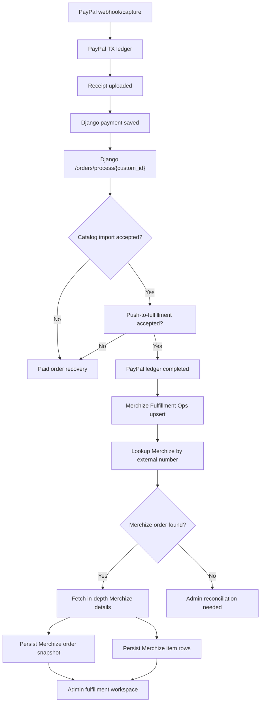
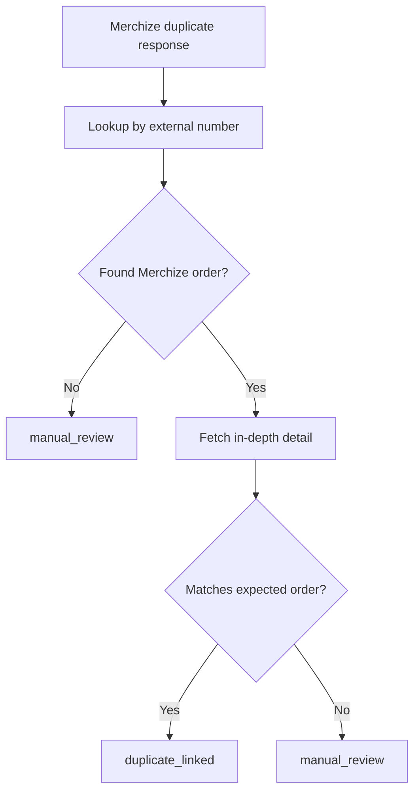
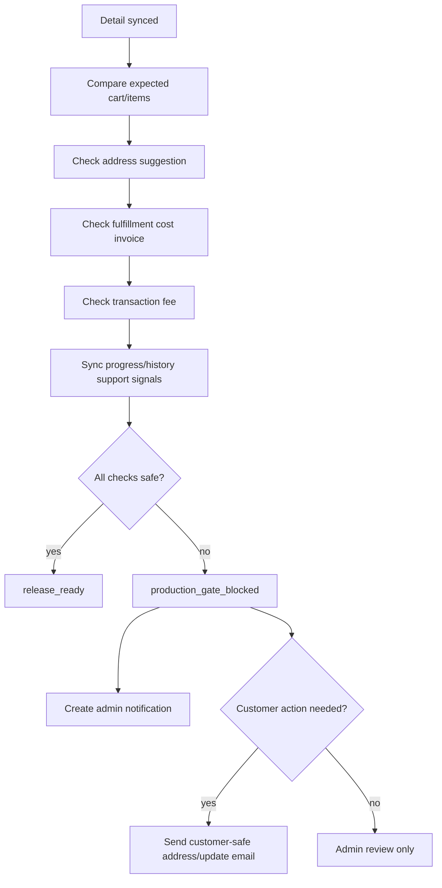

# Merchize Fulfillment Ops Guide

Last updated: 2026-06-20

This guide defines the Merchize side of Codex Christi paid order fulfillment processing. It is intentionally separate from the PayPal transaction ledger guide and the admin recovery tooling guide, but it is not merely a post-push sync guide.

The short version:

- The PayPal TX ledger answers: "Was the paid checkout safely captured, receipted, and saved?"
- Paid order fulfillment processing answers: "Did the paid order move through Django, Merchize catalog import, push-to-fulfillment, and operational checks without unsafe gaps?"
- The Merchize Fulfillment Ops layer answers: "What is the provider state, what needs attention, and what can admin safely repair or reconcile?"

This guide is intentionally Merchize-specific. Other POD suppliers can get their own ops guide later after this flow is stable.

Related source docs:

- `PAYPAL_TX_LEDGER_GUIDE.md`
- `ADMIN_RECOVERY_TOOLING_GUIDE.md`
- `PAYPAL_WEBHOOK_REGISTRATION_AND_RECOVERY_GUIDE.md`

---

# 1) Scope Boundary

## Corrected 2026-06 scope

The previous wording treated Merchize Fulfillment Ops as beginning only after an accepted Django handoff. That is too narrow.

The corrected domain is:

```txt
runPaidFulfillmentProcessing(orderToken)
```

This is the semantic replacement for the older `runPostProcessing(orderToken)` name. Do not keep `runPostProcessing` as an alias-only fallback. Runtime callers should use `runPaidFulfillmentProcessing`.

Paid order fulfillment processing starts when PayPal capture already exists and the server has enough ledger state to continue without the shopper's browser. It includes:

1. Receipt generation/upload.
2. Django payment save.
3. Merchize catalog-backed fulfillment payload validation.
4. Catalog external order import.
5. Push-to-fulfillment.
6. Provider lookup/status/tracking/attention checks.
7. Admin recovery and reconciliation.

## Provider start point

The Merchize-specific provider stages start after Django payment save returns:

```txt
djangoPaymentSaveCustomId
```

That value is the path value for:

```txt
POST /orders/process/{custom_id}
```

In current Django language, `{custom_id}` is returned by:

```txt
POST /orders/order-payment
```

The local codebase names this value:

```txt
djangoPaymentSaveCustomId
```

## Does not own directly

Merchize Fulfillment Ops does not own the payment side effects themselves:

- Checkout form state.
- Django order-intent OTP creation or verification.
- PayPal order creation.
- PayPal authorization or capture.
- PayPal webhook verification.
- Customer-side unresolved paid checkout warning.

Those remain owned by the PayPal TX ledger and checkout recovery flows. The paid order fulfillment runner may orchestrate receipt upload and Django payment save as prerequisites, but Merchize-specific code must not replay PayPal capture, receipt upload, or Django payment save after those artifacts already exist.

## Owns

Merchize Fulfillment Ops owns the provider lifecycle inside paid order fulfillment processing:

- Catalog-backed external order import using Merchize catalog/SKU data.
- Push-to-fulfillment as an explicit success boundary.
- Merchize lookup by external number.
- Merchize order ID extraction.
- In-depth Merchize order detail fetch.
- Merchize item snapshot persistence.
- Duplicate-order reconciliation.
- Merchize status tracking.
- Merchize tracking sync.
- Production readiness checks before release/open.
- Address suggestion, address review, and buyer detail correction workflow.
- Fulfillment cost, transaction fee, and availability checks.
- Order progress and order history sync.
- Admin and customer notification triggers for provider-side blockers.
- Future Merchize actions such as change product, change processing, hold, cancel, escalation, and manual Merchize order linking.
- Admin-facing Merchize diagnostics and operational actions.

---

# 2) Current Contract Knowledge

## Django process response can be accepted even with an informational message

The Django process endpoint can return:

```txt
status: 201
success: true
message: "Order processed successfully."
data.processing_status: "completed"
data.error_message: "Order created but details not available"
```

This is not automatically a failure. It means Django accepted the process step. Under the corrected scope, it counts as final paid-order fulfillment success only if the Django process contract confirms that it performed or accepted the Merchize push-to-fulfillment stage, not merely catalog import.

Implementation rule:

- Do not classify the known informational message as `fulfillment_failed` when Django also reports `success: true` and `processing_status: completed`.
- Do not replay PayPal capture, receipt upload, or Django payment save for this response.
- If Django's process endpoint cannot prove push-to-fulfillment was accepted, add an explicit server-only push stage before marking the paid order fulfillment runner complete.

## Merchize duplicate can be idempotent

When Merchize says an order is duplicated, it can mean Merchize already has an order for that external number. That should be treated as a reconciliation signal first, not as a new unrecoverable failure.

Implementation rule:

- If the Merchize duplicate response includes enough Merchize data to identify or lookup the existing order, move to lookup/detail sync.
- If the duplicate response has no usable identifier and lookup fails, create an admin-visible reconciliation issue.

## Django wrapped Merchize response may contain Merchize identifiers

The Django process response may wrap Merchize data with a process-time `_id`, status, enqueue flags, and item snapshots.

Implementation rule:

- Extract the provider-facing `order_id` as `merchizeExternalOrderNumber` when present.
- Do not treat the wrapped process `response_data.data._id` as the in-depth detail path ID.
- The authoritative `merchizeOrderId` for `GET /order/orders/{id}` must come from `resp.data._id` returned by `GET /order/external/orders/order-detail?external_number=...`.
- That same `merchizeOrderId` is the default Merchize platform identifier for later POD actions such as view, edit, pause, change product, change processing, and tracking/status operations.
- Persist raw Merchize snapshots only in access-controlled DB fields.
- Show redacted summaries in admin UI, logs, and notification emails.

## PII handling

Merchize payloads can contain full names, email, phone, and shipping addresses. Do not copy real customer payload examples into guides, logs, screenshots, issue summaries, or emails.

Allowed in guides and logs:

- `orderToken`
- `djangoPaymentSaveCustomId`
- Merchize order ID
- Merchize status
- Merchize action type
- redacted customer email such as `c***@domain.com`
- counts and status summaries

Not allowed in guides and logs:

- Full customer address.
- Full customer phone.
- Full customer email unless explicitly needed in a secured admin UI.
- Raw Merchize JSON in console logs.

---

# 2A) Exported Endpoint Coverage

This section is based on the exported Postman folder named `New Order Placement via External API` inside the `bo-group-2-2.merchize.com` collection, plus the adjacent HAR-derived Merchize order support collection.

Do not commit the raw Postman exports. They contain test payloads, example addresses, emails, and auth variables. The implementation should store only redacted summaries in logs and guide examples.

## Credential reality and endpoint priority

The exported collections include endpoints that appear to use more than one auth style:

- Merchize external-order API endpoints that are expected to work with a server-side API key.
- Merchize dashboard/support-view endpoints that include `x-store-id` and may also require a dashboard refresh/session token.
- Seller/product-management endpoints that appear closer to the provider's internal dashboard workflow.

Current known credential state:

- `x-store-id` is available.
- `x-refresh-token` is not available.
- The implementation should not depend on dashboard-only endpoints until Merchize provides a stable, authorized server-side credential for them.

Implementation rule:

- Prioritize endpoints that can run from the server with `MERCHIZE_API_KEY` or another official server credential.
- Treat `x-store-id` as store context, not proof of authorization by itself.
- Do not scrape, replay, or persist browser dashboard session tokens as an integration strategy.
- If a useful endpoint requires `x-refresh-token`, document it as blocked/pending provider auth and keep the admin UI fallback as "open in Merchize dashboard" or "manual provider check".
- The goal is not to rebuild the full Merchize UI. The goal is to avoid logging into Merchize for routine Codex Christi order operations.

Essential first-party needs for Codex Christi:

- Confirm Merchize received the order.
- Resolve `merchizeExternalOrderNumber` into canonical `merchizeOrderId`.
- Fetch the in-depth order detail snapshot.
- See whether the order is pending, held, open, fulfilled, failed, or requires attention.
- Check address validity and save address corrections when safe.
- Check fulfillment cost/fee state before release.
- Hold or open/release production with admin reason and audit history.
- Track progress/history enough to notify support and customers responsibly.

Non-essential for the first implementation:

- Full Merchize dashboard parity.
- Product catalog browsing inside order ops.
- Product replacement/change-product flows.
- Processing-method changes.
- Direct Merchize order creation outside Django's current handoff.
- Refund/dispute operations, which belong to PayPal post-sale tooling.

## Core external-order flow

These endpoints define the core catalog-backed fulfillment chain:

```txt
POST /order/external/orders/catalog
POST /order/external/orders/push
GET  /order/external/orders/order-detail?external_number={externalNumber}&identifier={fulfillmentIdentifier}
GET  /order/orders/{merchizeOrderId}
```

Operational meaning:

- `POST /order/external/orders/catalog` is Merchize's direct external-order import endpoint.
- `POST /order/external/orders/push` is Merchize's push-to-fulfillment endpoint.
- Catalog import is not final fulfillment success by itself. Push-to-fulfillment acceptance is the final provider write boundary before operational monitoring.
- In the current Codex Christi runtime, Django `/orders/process/{custom_id}` is treated as catalog-backed process acceptance/import. Next.js performs the explicit server-only Merchize push stage before setting the paid order fulfillment runner complete.
- A future Django contract may satisfy push-to-fulfillment only if it proves push acceptance directly. Until then, accepted Django 201 rows are not final success by themselves.
- Merchize Ops should not replay direct Merchize creation during normal sync unless the target stage is explicitly incomplete and idempotency checks pass.
- Direct creation or manual linking belongs to admin repair flows and must require admin confirmation and an audit reason.
- `external_number` is the provider-facing order string, currently the `ORD-...` value from Django's wrapped process response.
- `resp.data._id` from the external-number lookup is the canonical `merchizeOrderId`.
- All later Merchize actions should use `merchizeOrderId`, not Django's wrapped process `_id`.

Push request shape:

```txt
POST /order/external/orders/push
{
  "order": {
    "code": "{merchizeOrderCode}",
    "external_number": "{merchizeExternalOrderNumber}",
    "identifier": "{fulfillmentIdentifier}"
  }
}
```

Implementation rules:

- Prefer `external_number + identifier` for Codex Christi orders.
- Use `code` when Merchize already returned a stable internal order code and the external number is ambiguous.
- Name the local variable `fulfillmentIdentifier`, then map it to Merchize's `identifier` field at the adapter boundary.
- Do not use `djangoPaymentSaveCustomId` as the external number.

## Production control endpoints

These external-order endpoints control provider order release and admin repair actions:

```txt
POST /order/external/orders/update-order-status
POST /order/external/orders/cancel
```

Known status payload meanings:

- `action = hold`: pause order progress for edit/review.
- `action = resume`: resume order progress after review.
- `cancel` is a destructive provider mutation and must stay behind an admin reason, audit log, and step-up confirmation before UI exposure.

Implementation rule:

- Opening/releasing production is a dangerous admin action unless the automatic production gate has passed.
- Hold/open actions must record an admin reason and must create an admin action history row.
- Future production auth should require WebAuthn/passkey step-up for open/resume, hold, cancel, and manual resolution.

## External operational snapshots

These server-auth endpoints feed admin reconciliation after push acceptance:

```txt
GET  /order/external/orders/order-progress
GET  /order/external/orders/tracking
GET  /order/external/orders/order-invoice
POST /order/external/orders/list-orders-detail
POST /order/external/orders/list-orders-tracking
POST /order/external/orders/list-orders-invoice
```

Implementation rules:

- Use `external_number + identifier` for single-order queries when the Codex Christi external number is known.
- Persist progress into `merchizeProgressPayload`, tracking into `merchizeTrackingPayload`, and invoice/cost state into `merchizeFulfillmentCostPayload`.
- Snapshot sync failures should create failed sync attempts and admin-visible reconciliation state, but they should not undo a successful push-to-fulfillment completion.

## Current post-push notifications and reconciliation gaps

The runtime now records successful push-to-fulfillment in Merchize Fulfillment Ops, completes the PayPal TX ledger row, and creates tracked success notifications.

Implemented customer-facing behavior:

- After `pushMerchizeFulfillmentOrderToProduction(...)` succeeds, the runner enqueues and sends `paid_order_fulfillment_push_accepted`.
- Customer delivery uses `CustomerNotificationOutbox` in the PayPal TX ledger so the send attempt is durable and visible in admin detail.
- Customer copy stays safe: payment received, the order is being prepared, support reference is `orderToken`, and receipt link when available.
- Customer emails must not include raw provider payloads, full internal provider IDs, or address data beyond what already belongs in the customer confirmation context.

Implemented admin-facing behavior:

- Successful push acceptance enqueues `paid_order_fulfillment_push_accepted` in `AdminNotificationOutbox`.
- Success emails route through `paid_order_fulfillment_success`, falling back to `ORDER_RECOVERY_ADMIN_EMAILS` only when Admin Ops recipients are unavailable.
- Failure/blocking/attention states still route through `paid_order_fulfillment_issues`.
- Admin success rows include `orderToken`, `merchizeExternalOrderNumber`, `merchizeOrderId` when known, `merchizeOrderCode`, and the recovery detail URL.

Remaining post-push escalation work:

- Convert progress/tracking/invoice snapshot failures into admin-visible reconciliation states when they persist after retry.
- Add explicit classification rules for `attention_required`, `blocked`, `address_review_required`, `product_unavailable`, `tracking_synced`, and `reconciled`.
- Add customer tracking/update emails only after tracking data is present and customer-safe.

Remaining dangerous admin action work:

- Push-disabled manual release has master-admin step-up, reason capture, confirmation, and audit logging.
- Pause/resume/cancel provider actions still need reason capture, audit logging, confirmation, and eventual step-up auth before production use.
- Cancel remains out of automatic workflow scope.

## Semi-real provider test with push disabled

Current runtime status:

- `MERCHIZE_FULFILLMENT_PUSH_ENABLED` is the server-only push gate. Empty or missing means enabled. Valid explicit values are `true` and `false`.
- When `MERCHIZE_FULFILLMENT_PUSH_ENABLED=false`, the runner completes the payment-owned stages, calls Django payment save, calls Django fulfillment process/import, registers the accepted Merchize process, runs external-number lookup/detail sync when safe, and stops before `POST /order/external/orders/push`.
- The stopped state is explicit: PayPal ledger `status = fulfillment_attention_required`, `lastErrorCode = MERCHIZE_PUSH_DISABLED_BY_CONFIG`, Merchize Ops `syncStatus = push_to_fulfillment_disabled`, and `productionGateStatus = push_disabled`.
- The stopped state creates a durable admin notification outbox row and attempts to send the configured internal email, because this is an operator action item.
- The customer confirmation page does not expose provider internals. It shows the customer-safe manual-review/preparation state and the `orderToken` support reference.
- The confirmation page must not show raw Merchize IDs, raw Django process payloads, customer address payloads, or admin-only error detail.

Implemented admin override behavior:

- Admin recovery shows that provider push is disabled by configuration and offers a master-admin-only manual release on the order detail page.
- Manual release requires master admin authorization, fresh password step-up, browser confirmation, and an admin reason.
- Manual release calls `runPaidFulfillmentProcessing(orderToken, { overrideMerchizeFulfillmentPushDisabled: true })`.
- The runner lease and existing ledger fields prevent replay of PayPal capture, receipt generation, Django payment save, and an already accepted Django process/import.
- On override success, Merchize Ops persists `push_accepted`, sets `releasedToProductionAt`, the PayPal ledger is completed, operational snapshots run as non-blocking reconciliation, and customer/admin success notifications are enqueued and sent.
- On override failure, Merchize Ops persists `push_failed` when the provider push failed, the row remains recoverable, and the internal recovery notification/email path stays active.

Implemented customer/admin notification behavior:

- Customer email after automatic or manual push acceptance is tracked in `CustomerNotificationOutbox`.
- Admin emails are sent for push-disabled, push-failed, lookup-failed, provider-rejected, payload-invalid, and future attention-required states.
- Admin success emails for pushed orders route through `paid_order_fulfillment_success` so they can be separated from the higher-signal `paid_order_fulfillment_issues` stream.

## Current UI-led end-to-end verification runbook

Use this runbook to test the committed flow from the storefront UI, then verify the server state. This is for dev/staging only.

Safety rule:

- Do not run this against a live Merchize store unless the test order is intentionally allowed to be pushed to fulfillment.
- Set `MERCHIZE_FULFILLMENT_PUSH_ENABLED=false` for a semi-real checkout that should stop before provider push.
- The Django `/orders/process/{custom_id}` stage can create/import the external order before the Next.js Merchize Ops push stage runs. Use a staging Django backend or a provider mock if the test must not touch production fulfillment.

Preflight commands:

```bash
yarn prisma:paypalTxLedger:generate:dev
yarn prisma:merchizeFulfillmentOps:generate:dev
yarn prisma:adminOpsLedger:generate

PAYPAL_TX_LEDGER_NEON_BRANCH=dev yarn prisma migrate status --schema prisma/shop/paypal/paypalTXLedger.schema.prisma
MERCHIZE_FULFILLMENT_OPS_NEON_BRANCH=dev yarn prisma migrate status --schema prisma/shop/merchizeFulfillmentOps/merchizeFulfillmentOps.schema.prisma
yarn prisma migrate status --schema prisma/adminOpsLedger/adminOpsLedger.schema.prisma

./node_modules/.bin/tsc --noEmit --pretty false
yarn lint
```

Local env switches for a UI-led run:

```bash
PAYPAL_PAYMENT_MODE=sandbox
NEXT_PUBLIC_PAYPAL_PAYMENT_MODE=sandbox
PAYPAL_TX_LEDGER_NEON_BRANCH=dev
MERCHIZE_FULFILLMENT_OPS_NEON_BRANCH=dev
PAYPAL_TX_LEDGER_ENABLE_CAPTURE_ROUTE_RUNNER=true
NEXT_PUBLIC_SITE_URL=http://localhost:3000
MERCHIZE_FULFILLMENT_PUSH_ENABLED=false # semi-real no-push test
```

The confirmation status route is read-only. With webhooks/ngrok off, post-capture work is triggered by the capture route runner or by the scheduled recovery scanner/cron.

Provider safety setup:

- Safe full UI test: PayPal sandbox + Django staging/test backend + Merchize staging/test store.
- Safe mocked provider test: PayPal sandbox + Django staging/mock that returns the accepted process contract + Next.js Merchize API base URL pointed to a local mock that implements the external-order lookup, detail, push, progress, tracking, and invoice endpoints.
- Unsafe test: PayPal sandbox + production Django + live Merchize base URL. This can still create/import and push a real order.

For a Next.js-side Merchize mock, set server-only values like these in a local-only env file:

```bash
MERCHIZE_BO_API_BASE_URL=http://127.0.0.1:8787
MERCHIZE_API_KEY=dev-mock
MERCHIZE_ACCESS_TOKEN=dev-mock
```

The mock must return successful JSON for these current calls:

```txt
GET  /order/external/orders/order-detail?external_number=...&identifier=...
GET  /order/orders/{merchizeOrderId}
POST /order/external/orders/push
GET  /order/external/orders/order-progress?external_number=...&identifier=...
GET  /order/external/orders/tracking?external_number=...&identifier=...
GET  /order/external/orders/order-invoice?external_number=...&identifier=...
```

Storefront UI steps:

1. Start the app with `yarn dev`.
2. Open `http://localhost:3000/shop`.
3. Add a low-risk test item to cart.
4. Check out with a PayPal sandbox buyer account.
5. Wait for the redirect to `/shop/checkout/confirmation/{orderToken}`.
6. Keep the confirmation page open until it reaches either `Payment confirmed` or the manual-review state.
7. Copy the support reference. That value is the `orderToken`.

Expected current successful path:

- Confirmation page reaches `Payment confirmed`.
- Receipt download is available when receipt upload completed.
- PayPal ledger row has `status = completed` and `processingCompletedAt` set.
- Merchize Fulfillment Ops row has `syncStatus = push_to_fulfillment_accepted`, `productionGateStatus = push_accepted`, and `releasedToProductionAt` set.
- Sync attempts include `registration`, `external_lookup`, `detail_lookup`, `push_to_fulfillment`, and best-effort operational snapshot attempts for progress, tracking, and invoice.
- Customer notification outbox has `paid_order_fulfillment_push_accepted` for the customer recipient.
- Admin notification outbox has `paid_order_fulfillment_push_accepted` for each configured success recipient.

Expected current failure path:

- Provider rejection, lookup failure, missing external number, push failure, or local payload validation stops the runner before `completed`.
- Confirmation page shows the manual-review customer-safe state.
- PayPal ledger row is `fulfillment_failed` or `fulfillment_blocked`.
- Admin notification outbox receives a row and the runner attempts to send the configured admin email.
- Admin recovery can retry the remaining paid fulfillment runner without replaying PayPal capture.

Expected push-disabled path:

- Confirmation page shows the customer-safe manual-review/preparation state, not final fulfillment success.
- PayPal ledger row has `status = fulfillment_attention_required`, `processingCompletedAt = null`, and `lastErrorCode = MERCHIZE_PUSH_DISABLED_BY_CONFIG`.
- Merchize Fulfillment Ops row has `syncStatus = push_to_fulfillment_disabled` and `productionGateStatus = push_disabled`.
- Admin notification outbox receives a warning row for the stopped state and the runner attempts to send the configured admin email.
- No customer success email is sent before manual release.
- The admin detail page shows the master-admin manual release form. Successful release moves the order to the successful path above without replaying payment-owned stages.

Server verification without dumping raw payloads:

```bash
curl -s "http://localhost:3000/next-api/paypal/tx-ledger/payments/<orderToken>/status"
```

PayPal ledger check:

```sql
select
  "orderToken",
  "status",
  "djangoPaymentSaveCustomId",
  "merchizeFulfillmentProcessingId",
  "merchizeProviderOrderCode",
  "processingCompletedAt",
  "lastErrorCode",
  "lastErrorMessage"
from "PaypalIntent"
where "orderToken" = '<orderToken>';
```

Merchize Fulfillment Ops check:

```sql
select
  "orderToken",
  "merchizeExternalOrderNumber",
  "merchizeOrderId",
  "merchizeOrderCode",
  "syncStatus",
  "productionGateStatus",
  "progressStatus",
  "deliveryStatus",
  "costReviewStatus",
  "releasedToProductionAt",
  "lastSyncErrorCode",
  "lastSyncErrorMessage"
from "MerchizeFulfillmentOrder"
where "orderToken" = '<orderToken>'
order by "updatedAt" desc;
```

Sync attempt check:

```sql
select
  "action",
  "status",
  "errorCode",
  "errorMessage",
  "startedAt",
  "finishedAt"
from "MerchizeFulfillmentSyncAttempt"
where "orderToken" = '<orderToken>'
order by "createdAt" asc;
```

Admin notification check:

```sql
select
  "type",
  "stage",
  "errorCode",
  "severity",
  "status",
  "recipient",
  "sentAt",
  "lastErrorMessage"
from "AdminNotificationOutbox"
where "orderToken" = '<orderToken>'
order by "createdAt" asc;
```

Customer notification check:

```sql
select
  "type",
  "status",
  "recipient",
  "sentAt",
  "lastErrorMessage"
from "CustomerNotificationOutbox"
where "orderToken" = '<orderToken>'
order by "createdAt" asc;
```

Do not select raw payload columns during normal verification. Use the admin detail UI or a redacted debug path when payload inspection is required.

## Address and buyer detail endpoints

These endpoints support address review and correction:

```txt
GET  /bo-api/order/orders/{merchizeOrderId}/address-suggestion
POST /bo-api/order/orders/{merchizeOrderId}/buyerdetails
```

Implementation rule:

- Address suggestion should run before automatic production release.
- If Merchize returns an address suggestion, validation issue, unsupported country, or ambiguous result, set `addressReviewStatus = review_required`.
- Customer emails can request address confirmation, but raw provider payloads should never be sent to the customer.
- Admin/customer address corrections must be persisted as an address review record before calling `buyerdetails`.
- Country changes are cost-sensitive. After any country or postal-code change, rerun cost/fee checks before opening production.

## Cost and fee endpoints

These endpoints decide whether the order is financially and operationally safe to release:

```txt
GET /bo-api/order/orders/{merchizeOrderId}/fulfillment-cost-invoice
GET /bo-api/order/orders/{merchizeOrderId}/transaction-fee
```

The HAR-derived collection also contains:

```txt
GET /bo-api/order/orders/{merchizeOrderId}/fulfillment-invoice
GET /bo-api/order/orders/{merchizeOrderId}/ioss/display
```

Implementation rule:

- A failed fulfillment invoice means production should not auto-open.
- A transaction-fee response that indicates unpaid/invalid state means production should not auto-open.
- If cost changes after address correction, put the order in admin review before charging, refunding, or asking the customer for an extra payment.
- IOSS/tax display data should be captured as a provider snapshot where relevant, but it should not be shown to customers until the output is understood and formatted safely.

## Progress, history, and support-view endpoints

These endpoints provide provider lifecycle visibility:

```txt
GET /bo-api/order/orders/{merchizeOrderId}/histories
GET /bo-api/order/get-order-progress/{merchizeOrderId}
```

The HAR-derived collection also contains:

```txt
GET /bo-api/order/orders/{merchizeOrderId}/send-to-fulfillment-date
GET /bo-api/order/orders/{merchizeOrderId}/unfulfilled
GET /bo-api/order/orders/{merchizeOrderId}/buyerdetails
GET /bo-api/order/orders/{merchizeOrderId}/buyerdetails/display-status
GET /bo-api/order/orders/{merchizeOrderId}/require-attention
GET /bo-api/order/orders/{merchizeOrderId}/tags
GET /bo-api/order/orders/{merchizeOrderId}/notes
```

Implementation rule:

- Progress/history sync should be separate from payment-ledger completion.
- Progress events should drive admin state and customer-safe status updates.
- `require-attention`, unfulfilled items, buyer display status, tags, and notes should be treated as support signals.
- If these endpoints require `x-refresh-token` or another dashboard-session credential, do not include them in the automatic worker until Merchize provides a stable server-side auth path.
- Admin UI should show a compact provider status summary first, then expandable support details.
- When support-view endpoints are blocked by auth, show a clear admin state such as `Provider support detail unavailable`, plus a direct dashboard link if available.

## Adjacent collections that matter

Other exported collections add important adjacent capabilities:

- PayPal APIs:
  - PayPal shipment tracking endpoints can be used after Merchize provides carrier/tracking data.
  - PayPal transaction search can support reconciliation/backfill when local ledger and PayPal disagree.
  - PayPal capture/refund/dispute endpoints belong to later refund/dispute admin workflows.
- ZeptoMail:
  - Use the existing mailer through a durable outbox. Do not send customer/admin emails as untracked side effects.
- Checkout Recovery:
  - Checkout recovery OTP proves customer email ownership for unresolved paid checkout warnings.
  - It should not mutate Merchize provider state directly.
- Django/backend order endpoints:
  - Django remains the payment-save and `/orders/process/{custom_id}` boundary.
  - Merchize Ops participates in the paid order fulfillment runner after `djangoPaymentSaveCustomId` exists.
  - The process route can satisfy catalog import and push-to-fulfillment only when its response contract confirms those stages.

---

# 3) Relationship To The PayPal TX Ledger

## PayPal TX ledger remains the payment handoff ledger

The PayPal TX ledger should keep enough data to know whether checkout handoff succeeded:

- `orderToken`
- `paypalOrderId`
- `paypalAuthorizationId`
- `djangoOrderIntentUuid`
- `djangoOrderIntentOrderId`
- `djangoPaymentSaveCustomId`
- receipt link and receipt file name
- fulfillment request payload
- Django fulfillment response payload
- extracted Merchize order ID/code summary
- final handoff status

## Merchize Fulfillment Ops becomes the Merchize lifecycle database

The new database should store post-handoff Merchize lifecycle data:

- Merchize lookup snapshots
- Merchize in-depth detail snapshots
- Merchize order rows
- Merchize item rows
- sync attempts
- admin actions
- Merchize tracking events
- Merchize reconciliation notes

## Ledger-to-Merchize Ops field mapping

The PayPal TX ledger remains the source of truth for paid checkout state. Merchize Fulfillment Ops should mirror only the identifiers and snapshots needed to continue the provider lifecycle without replaying payment, receipt, Django payment-save, or Django process side effects.

`PaypalIntent.orderToken` -> `MerchizeFulfillmentOrder.orderToken`

- Purpose: customer support reference, admin URL key, and cross-system correlation.
- Required: yes.

`PaypalIntent.paypalOrderId` -> `MerchizeFulfillmentOrder.paypalOrderId`

- Purpose: PayPal search/escalation context.
- Required: optional.

`PaypalIntent.djangoOrderIntentUuid` -> `MerchizeFulfillmentOrder.djangoOrderIntentUuid`

- Purpose: trace back to the Django OTP/order-intent object.
- Required: optional.

`PaypalIntent.djangoOrderIntentOrderId` -> `MerchizeFulfillmentOrder.djangoOrderIntentOrderId`

- Purpose: trace the Django order-intent order string.
- Current behavior: this is usually the same `ORD-...` value as the Merchize external number.
- Required: yes, when available.

`PaypalIntent.djangoPaymentSaveCustomId` -> `MerchizeFulfillmentOrder.djangoPaymentSaveCustomId`

- Purpose: Django `/orders/process/{custom_id}` path key and Django payment-save correlation.
- Required: yes.

`PaypalIntent.merchizeFulfillmentResponsePayload.data.response_data.data.data.order_id` -> `MerchizeFulfillmentOrder.merchizeExternalOrderNumber`

- Purpose: external number used for Merchize external-number lookup.
- Endpoint: `GET /order/external/orders/order-detail?external_number=...`
- Required: yes.

Merchize external lookup `resp.data._id` -> `MerchizeFulfillmentOrder.merchizeOrderId`

- Purpose: canonical Merchize platform ID for in-depth detail and later provider actions.
- Used for: view, edit, pause, product changes, processing changes, tracking, and status actions.
- Required: yes, after lookup.

`PaypalIntent.merchizeFulfillmentResponsePayload` -> `MerchizeFulfillmentOrder.djangoProcessResponsePayload`

- Purpose: raw Django process response snapshot, including the wrapped Merchize response.
- Required: yes.

Merchize external lookup response -> `MerchizeFulfillmentOrder.merchizeExternalLookupPayload`

- Purpose: provider lookup proof and latest external-number snapshot.
- Required: yes, after lookup.

Merchize in-depth detail response -> `MerchizeFulfillmentOrder.merchizeInDepthOrderDetailPayload`

- Purpose: provider detail proof, item data, shipment/status data, and future admin action context.
- Required: yes, after detail sync.

Rules:

- `MerchizeFulfillmentOrder` must not replace `PaypalIntent`.
- `PaypalIntent` owns payment, receipt, Django save, and Django process completion.
- `MerchizeFulfillmentOrder` owns provider lifecycle after Django accepted the fulfillment process/import and the Next.js runner begins provider push/sync control.
- Use `orderToken` for customer support, URLs, and admin handoff.
- Use `djangoPaymentSaveCustomId` for Django `/orders/process/{custom_id}` correlation.
- Use `merchizeExternalOrderNumber` for Merchize external-number lookup.
- Use `merchizeOrderId` for Merchize platform actions after the external lookup succeeds.
- Do not store only provider IDs. Store the external lookup and in-depth detail snapshots so support can prove what Merchize returned at the time of sync.
- Do not populate `merchizeOrderId` from Django's wrapped process `response_data.data._id`. That value can stay in `djangoProcessResponsePayload`, but the actionable Merchize platform ID must come from external lookup `resp.data._id`.

If Merchize Fulfillment Ops later lives in the same physical database as the PayPal TX ledger, a foreign key to `PaypalIntent` can be added. While the plans keep these as separate schemas/databases, do not fake a database-level FK. Use the correlation keys above.

## Completed semantics

Recommended PayPal ledger meaning:

```txt
status = completed
```

means:

```txt
Payment captured, receipt uploaded, payment saved to Django, and Django/Merchize fulfillment push accepted.
```

It should not mean:

```txt
Merchize has shipped, delivered, or fully synchronized all detail snapshots.
```

Those later states belong to Merchize Fulfillment Ops.

Why:

- The customer should not be held in a scary checkout state because a Merchize detail lookup is delayed.
- Admin/support still gets a durable Merchize lifecycle view in Merchize Fulfillment Ops.
- Merchize sync can be retried independently without replaying payment/receipt/Django save side effects.

---

# 4) Identifier Map

Use names that say which system owns the value.

```txt
orderToken
```

Local PayPal TX ledger support reference. Also mirrored into PayPal custom id where supported.

```txt
paypalOrderId
```

PayPal order ID.

```txt
djangoOrderIntentUuid
```

Django order-intent UUID from the OTP/order-intent flow.

```txt
djangoOrderIntentOrderId
```

Django order-intent order string. This was formerly easy to confuse with an OTP order ID.

```txt
djangoPaymentSaveCustomId
```

Django payment-save custom ID returned by `/orders/order-payment`. Django uses this as the path key for `/orders/process/{custom_id}`.

```txt
merchizeExternalOrderNumber
```

The value sent to Merchize `external_number` lookup. This is confirmed as the provider-facing order string from Django's wrapped Merchize response: `response_data.data.data.order_id`.

In the current checkout flow, this is the `ORD-...` string that also appears as `djangoOrderIntentOrderId` and as the suffix of the wrapped Merchize `identifier`.

Do not confuse this with `djangoPaymentSaveCustomId`. The payment-save custom ID is the Django `/orders/process/{custom_id}` path key, not the primary Merchize external-number lookup value.

```txt
merchizeOrderId
```

Merchize `_id` returned by the external-number lookup response as `resp.data._id`. This is the canonical Merchize platform order ID.

Use it as the path/key value for in-depth detail lookup and later POD actions such as view, edit, pause, change product, change processing, and tracking/status operations.

Do not use the wrapped Django process `response_data.data._id` for this field. Always populate this field from the external-number lookup response.

```txt
merchizeOrderCode
```

Merchize-facing order code or external order string when present.

```txt
merchizeIdentifier
```

The identifier sent through the Django process payload. Current value:

```txt
codexchristi-shop
```

```txt
djangoProcessResponsePayload
```

Raw Django response from `/orders/process/{custom_id}`. This can include a wrapped Merchize response.

```txt
merchizeExternalLookupPayload
```

Raw response from Merchize external-number lookup.

```txt
merchizeInDepthOrderDetailPayload
```

Raw response from Merchize in-depth order detail lookup.

---

# 5) Target Flow



Important boundary:

- The PayPal ledger can complete after push-to-fulfillment acceptance and before in-depth Merchize detail sync completes.
- Merchize Fulfillment Ops can fail/retry without moving the PayPal ledger backward.

---

# 6) Database Strategy

## Recommended DB boundary

Use a separate Prisma schema and datasource for Merchize Fulfillment Ops.

Recommended location:

```txt
prisma/shop/merchizeFulfillmentOps/merchizeFulfillmentOps.schema.prisma
```

Recommended client wrapper:

```txt
src/lib/prisma/shop/merchizeFulfillmentOps/merchizeFulfillmentOpsPrisma.ts
```

Recommended generated client:

```txt
src/lib/prisma/shop/merchizeFulfillmentOps/generated/merchizeFulfillmentOps
```

Recommended environment variable:

```txt
MERCHIZE_FULFILLMENT_OPS_DATABASE_URL
```

If Neon branches are used:

```txt
MERCHIZE_FULFILLMENT_OPS_NEON_BRANCH=dev
MERCHIZE_FULFILLMENT_OPS_NEON_BRANCH=prod
```

## Why separate DB/schema

Benefits:

- Keeps payment orchestration isolated from Merchize lifecycle complexity.
- Makes admin tooling safer because Merchize sync can be retried independently.
- Keeps high-volume Merchize payload snapshots away from the core payment ledger.
- Allows different retention policies for Merchize payloads and operational audit logs.

Tradeoffs:

- Cross-DB joins are not available directly.
- Admin views must query PayPal ledger and Merchize Fulfillment Ops separately, then merge by `orderToken` or `djangoPaymentSaveCustomId`.
- Transactions cannot atomically update PayPal ledger and Merchize Fulfillment Ops if they live in different physical DBs.

Decision default:

- Accept the tradeoff.
- Use `orderToken` and `djangoPaymentSaveCustomId` as durable correlation keys.
- Treat Merchize Fulfillment Ops sync as eventually consistent.

---

# 7) Proposed Merchize Models

Use Merchize-specific table names for this phase. The current Django process contract, lookup endpoint, duplicate behavior, and item payloads are all Merchize-specific.

## MerchizeFulfillmentOrder

```prisma
model MerchizeFulfillmentOrder {
  id                              String    @id @default(cuid())

  // Correlation with PayPal TX ledger.
  // If this table later moves into the same physical DB as PaypalIntent,
  // add a real FK. In the separate-DB design, keep these as correlation keys.
  orderToken                      String
  paypalOrderId                   String?
  djangoOrderIntentUuid           String?
  djangoOrderIntentOrderId        String?
  djangoPaymentSaveCustomId       String

  // Merchize identity.
  merchizeExternalOrderNumber     String
  merchizeOrderId                 String?
  merchizeOrderCode               String?
  merchizeIdentifier              String?
  merchizeStatus                  String?
  merchizeSubStatus               String?
  merchizeIsEnqueued              Boolean?
  merchizeIsDeleted               Boolean?
  merchizeHidden                  Boolean?

  // Production gate state.
  productionGateStatus            String?
  addressReviewStatus             String?
  costReviewStatus                String?
  progressStatus                  String?
  deliveryStatus                  String?
  releasedToProductionAt          DateTime?
  heldAt                          DateTime?
  lastAddressCheckAt              DateTime?
  lastCostCheckAt                 DateTime?
  lastProgressSyncAt              DateTime?
  lastHistorySyncAt               DateTime?

  // Handoff snapshots.
  djangoProcessResponsePayload    Json?
  merchizeExternalLookupPayload   Json?
  merchizeInDepthOrderDetailPayload Json?
  merchizeAddressSuggestionPayload Json?
  merchizeFulfillmentCostPayload  Json?
  merchizeTransactionFeePayload   Json?
  merchizeProgressPayload         Json?
  merchizeHistoryPayload          Json?

  // Operational state.
  syncStatus                      String
  lastSyncErrorCode               String?
  lastSyncErrorMessage            String?
  lastLookupAt                    DateTime?
  lastDetailSyncAt                DateTime?
  duplicateDetectedAt             DateTime?
  manuallyLinkedAt                DateTime?
  manuallyLinkedBy                String?
  manualLinkReason                String?

  createdAt                       DateTime  @default(now())
  updatedAt                       DateTime  @updatedAt

  @@unique([merchizeExternalOrderNumber])
  @@index([orderToken])
  @@index([djangoPaymentSaveCustomId])
  @@index([merchizeOrderId])
  @@index([merchizeOrderCode])
  @@index([merchizeStatus])
  @@index([syncStatus])
  @@index([productionGateStatus])
  @@index([addressReviewStatus])
  @@index([costReviewStatus])
  @@index([progressStatus])
  @@index([deliveryStatus])
  @@index([updatedAt])
}
```

## MerchizeFulfillmentItem

```prisma
model MerchizeFulfillmentItem {
  id                         String   @id @default(cuid())
  merchizeFulfillmentOrderId String

  merchizeLineItemId         String?
  productId                  String?
  merchizeSku                String?
  sellerSku                  String?
  title                      String?
  quantity                   Int
  currency                   String?
  unitPrice                  Decimal?

  // Redacted display helpers can be copied out of payload for admin scanning.
  imageUrl                   String?
  variantSummary             String?

  itemPayload                Json
  createdAt                  DateTime @default(now())
  updatedAt                  DateTime @updatedAt

  @@index([merchizeFulfillmentOrderId])
  @@index([merchizeSku])
  @@index([sellerSku])
  @@index([productId])
}
```

## MerchizeFulfillmentSyncAttempt

```prisma
model MerchizeFulfillmentSyncAttempt {
  id                         String   @id @default(cuid())
  merchizeFulfillmentOrderId String?

  orderToken                 String
  action                     String
  status                     String
  errorCode                  String?
  errorMessage               String?
  requestSummary             Json?
  responseSummary            Json?

  startedAt                  DateTime @default(now())
  finishedAt                 DateTime?

  @@index([merchizeFulfillmentOrderId])
  @@index([orderToken])
  @@index([action])
  @@index([status])
  @@index([startedAt])
}
```

## MerchizeFulfillmentAdminAction

```prisma
model MerchizeFulfillmentAdminAction {
  id                         String   @id @default(cuid())
  merchizeFulfillmentOrderId String?

  orderToken                 String
  action                     String
  status                     String
  adminActorId               String?
  adminActorLabel            String?
  reason                     String?
  payload                    Json?
  result                     Json?
  errorMessage               String?

  createdAt                  DateTime @default(now())
  completedAt                DateTime?

  @@index([merchizeFulfillmentOrderId])
  @@index([orderToken])
  @@index([action])
  @@index([status])
  @@index([createdAt])
}
```

## MerchizeFulfillmentTrackingEvent

```prisma
model MerchizeFulfillmentTrackingEvent {
  id                         String   @id @default(cuid())
  merchizeFulfillmentOrderId String

  carrier                    String?
  trackingNumber             String?
  trackingUrl                String?
  status                     String?
  eventPayload               Json
  eventTime                  DateTime?
  createdAt                  DateTime @default(now())

  @@index([merchizeFulfillmentOrderId])
  @@index([trackingNumber])
  @@index([status])
  @@index([eventTime])
}
```

## MerchizeFulfillmentProgressEvent

```prisma
model MerchizeFulfillmentProgressEvent {
  id                         String   @id @default(cuid())
  merchizeFulfillmentOrderId String

  orderToken                 String
  merchizeOrderId            String?
  event                      String
  status                     String?
  expectedAt                 DateTime?
  actualAt                   DateTime?
  eventPayload               Json
  syncedAt                   DateTime @default(now())

  @@index([merchizeFulfillmentOrderId])
  @@index([orderToken])
  @@index([merchizeOrderId])
  @@index([event])
  @@index([status])
  @@index([syncedAt])
}
```

## MerchizeFulfillmentHistoryEvent

```prisma
model MerchizeFulfillmentHistoryEvent {
  id                         String   @id @default(cuid())
  merchizeFulfillmentOrderId String

  orderToken                 String
  merchizeOrderId            String?
  event                      String?
  status                     String?
  message                    String?
  historyPayload             Json
  eventTime                  DateTime?
  syncedAt                   DateTime @default(now())

  @@index([merchizeFulfillmentOrderId])
  @@index([orderToken])
  @@index([merchizeOrderId])
  @@index([event])
  @@index([status])
  @@index([eventTime])
}
```

## MerchizeFulfillmentAddressReview

```prisma
model MerchizeFulfillmentAddressReview {
  id                         String   @id @default(cuid())
  merchizeFulfillmentOrderId String

  orderToken                 String
  status                     String
  source                     String
  issueCode                  String?
  issueMessage               String?
  originalAddressSummary     Json?
  suggestedAddressSummary    Json?
  correctedAddressSummary    Json?
  suggestionPayload          Json?
  adminActorId               String?
  adminReason                String?
  customerNotifiedAt         DateTime?
  resolvedAt                 DateTime?
  createdAt                  DateTime @default(now())
  updatedAt                  DateTime @updatedAt

  @@index([merchizeFulfillmentOrderId])
  @@index([orderToken])
  @@index([status])
  @@index([issueCode])
  @@index([createdAt])
}
```

## MerchizeFulfillmentCostSnapshot

```prisma
model MerchizeFulfillmentCostSnapshot {
  id                         String   @id @default(cuid())
  merchizeFulfillmentOrderId String

  orderToken                 String
  snapshotType               String
  status                     String
  currency                   String?
  amount                     Decimal?
  issueCode                  String?
  issueMessage               String?
  payload                    Json
  syncedAt                   DateTime @default(now())

  @@index([merchizeFulfillmentOrderId])
  @@index([orderToken])
  @@index([snapshotType])
  @@index([status])
  @@index([syncedAt])
}
```

## MerchizeFulfillmentNotificationOutbox

Use this model only if Merchize Fulfillment Ops lives in a separate database from the current PayPal `AdminNotificationOutbox`. The outbox should live beside the state mutation that creates the notification, so a failed email send cannot hide the provider recovery state.

```prisma
model MerchizeFulfillmentNotificationOutbox {
  id                         String   @id @default(cuid())
  merchizeFulfillmentOrderId String?

  orderToken                 String
  type                       String
  issueCode                  String?
  severity                   String   @default("warning")
  status                     String   @default("pending")
  dedupeKey                  String   @unique
  recipient                  String?
  payload                    Json
  attemptCount               Int      @default(0)
  lastAttemptAt              DateTime?
  sentAt                     DateTime?
  suppressedAt               DateTime?
  lastErrorMessage           String?
  createdAt                  DateTime @default(now())
  updatedAt                  DateTime @updatedAt

  @@index([merchizeFulfillmentOrderId])
  @@index([orderToken])
  @@index([type])
  @@index([issueCode])
  @@index([severity])
  @@index([status])
  @@index([createdAt])
}
```

---

# 8) Sync Status Vocabulary

Use string statuses first. Prisma enums can be added later after the vocabulary stabilizes.

```ts
export const MERCHIZE_FULFILLMENT_SYNC_STATUS = {
  SYNC_PENDING: 'sync_pending',
  PROCESS_ACCEPTED: 'process_accepted',
  LOOKUP_PENDING: 'lookup_pending',
  LOOKUP_FAILED: 'lookup_failed',
  LOOKUP_NOT_FOUND: 'lookup_not_found',
  LOOKUP_FOUND: 'lookup_found',
  DETAIL_SYNC_PENDING: 'detail_sync_pending',
  DETAIL_SYNC_FAILED: 'detail_sync_failed',
  DETAIL_SYNCED: 'detail_synced',
  DUPLICATE_DETECTED: 'duplicate_detected',
  DUPLICATE_LINKED: 'duplicate_linked',
  MANUAL_REVIEW: 'manual_review',
  MANUALLY_LINKED: 'manually_linked',
  MERCHIZE_FAILED: 'merchize_failed',
  TRACKING_PENDING: 'tracking_pending',
  TRACKING_SYNCED: 'tracking_synced',
  PRODUCTION_GATE_PENDING: 'production_gate_pending',
  PRODUCTION_GATE_PASSED: 'production_gate_passed',
  PRODUCTION_GATE_BLOCKED: 'production_gate_blocked',
  ADDRESS_REVIEW_REQUIRED: 'address_review_required',
  ADDRESS_CORRECTION_SENT: 'address_correction_sent',
  ADDRESS_CORRECTED: 'address_corrected',
  COST_REVIEW_REQUIRED: 'cost_review_required',
  COST_CHECK_PASSED: 'cost_check_passed',
  PAUSED_FOR_REVIEW: 'paused_for_review',
  RELEASE_READY: 'release_ready',
  RELEASED_TO_PRODUCTION: 'released_to_production',
  PROGRESS_SYNCED: 'progress_synced',
  HISTORY_SYNCED: 'history_synced',
  DELIVERY_EXCEPTION: 'delivery_exception',
} as const;
```

## Status meanings

`sync_pending`

The Merchize Fulfillment Ops row exists, but no Merchize lookup has run yet.

`process_accepted`

Django accepted `/orders/process/{custom_id}`.

`lookup_pending`

Merchize external-number lookup is queued or running.

`lookup_failed`

The Merchize lookup request failed due to transport, auth, rate limit, or Merchize error.

`lookup_not_found`

The lookup succeeded but did not find an order for the expected external number.

`lookup_found`

The Merchize lookup found an order and yielded a Merchize order ID.

`detail_sync_pending`

In-depth Merchize order detail fetch is queued or running.

`detail_sync_failed`

Merchize order detail fetch failed.

`detail_synced`

Merchize order detail and item snapshots were persisted.

`duplicate_detected`

Merchize reported a duplicate condition.

`duplicate_linked`

The duplicate response was successfully linked to an existing Merchize order.

`manual_review`

Admin action is required before the system should continue.

`manually_linked`

Admin manually attached a Merchize order ID or external number.

`merchize_failed`

Merchize says the fulfillment order failed or cannot be processed.

`tracking_pending`

Order detail exists, but tracking sync is not complete.

`tracking_synced`

Tracking details were persisted.

`production_gate_pending`

The order has provider identity/details, but production readiness checks have not finished.

`production_gate_passed`

Address, item, cost, and provider-state checks passed. The order is safe to open/release according to current rules.

`production_gate_blocked`

At least one production readiness check failed or needs manual review.

`address_review_required`

Merchize address suggestion, invalid address, unsupported destination, or ambiguous buyer details require admin/customer review.

`address_correction_sent`

The system notified the customer or admin that address correction is needed.

`address_corrected`

Corrected buyer details were saved locally and pushed to Merchize.

`cost_review_required`

Fulfillment invoice, transaction fee, country change, tax/IOSS, or product availability needs admin review before production release.

`cost_check_passed`

Cost and fee checks did not block production.

`paused_for_review`

The Merchize order is held while admin/customer/provider review is active.

`release_ready`

The order can be opened/released, but the release action has not run yet.

`released_to_production`

The order was opened/released to production.

`progress_synced`

Provider progress/checkpoint data was persisted.

`history_synced`

Provider history data was persisted.

`delivery_exception`

Provider progress/history/tracking suggests shipment or delivery needs support attention.

---

# 9) Merchize API Adapter

The Merchize API code should live behind a small adapter boundary.

Recommended files:

```txt
src/lib/merchizeFulfillmentOps/merchizeClient.ts
src/lib/merchizeFulfillmentOps/merchizeTypes.ts
src/lib/merchizeFulfillmentOps/merchizeMapper.ts
src/lib/merchizeFulfillmentOps/syncMerchizeFulfillmentOrder.ts
```

## Client responsibilities

`merchizeClient.ts` should own:

- base URL normalization
- API key header
- safe fetch wrapper
- JSON parsing
- response text capture for failed responses
- timeout handling
- Merchize error classification

## Adapter methods

```ts
export async function getMerchizeOrderByExternalNumber(externalNumber: string) {
  // GET /order/external/orders/order-detail?external_number=...
}

export async function getMerchizeInDepthOrderDetail(merchizeOrderId: string) {
  // GET /bo-api/order/orders/{id}
}

export async function getMerchizeAddressSuggestion(merchizeOrderId: string) {
  // GET /bo-api/order/orders/{id}/address-suggestion
}

export async function updateMerchizeBuyerDetails(merchizeOrderId: string, payload: unknown) {
  // POST /bo-api/order/orders/{id}/buyerdetails
}

export async function getMerchizeFulfillmentCostInvoice(merchizeOrderId: string) {
  // GET /bo-api/order/orders/{id}/fulfillment-cost-invoice
}

export async function getMerchizeTransactionFee(merchizeOrderId: string) {
  // GET /bo-api/order/orders/{id}/transaction-fee
}

export async function getMerchizeOrderHistory(merchizeOrderId: string) {
  // GET /bo-api/order/orders/{id}/histories
}

export async function getMerchizeOrderProgress(merchizeOrderId: string) {
  // GET /bo-api/order/get-order-progress/{id}
}

export async function holdMerchizeOrderForReview(merchizeOrderId: string) {
  // PATCH /bo-api/order/update-order-status/{id}
}

export async function openMerchizeOrderForProduction(merchizeOrderId: string) {
  // PATCH /bo-api/order/update-order-status/{id}
}
```

## Deferred dashboard/support-view adapter methods

These come from the HAR-derived order support collection. They should be added only after the auth requirement is confirmed and the server has a stable credential that is safe to store outside the browser.

```ts
export async function getMerchizeSendToFulfillmentDate(merchizeOrderId: string) {}
export async function getMerchizeUnfulfilledItems(merchizeOrderId: string) {}
export async function getMerchizeFulfillmentInvoice(merchizeOrderId: string) {}
export async function getMerchizeIossDisplay(merchizeOrderId: string) {}
export async function getMerchizeBuyerDetails(merchizeOrderId: string) {}
export async function getMerchizeBuyerDetailsDisplayStatus(merchizeOrderId: string) {}
export async function getMerchizeRequireAttention(merchizeOrderId: string) {}
export async function getMerchizeOrderTags(merchizeOrderId: string) {}
export async function getMerchizeOrderNotes(merchizeOrderId: string) {}
```

Rules:

- Treat these as support snapshots, not payment truth.
- Store raw responses behind admin-only access.
- Use normalized summaries for list views, notification emails, and customer-facing messages.
- Do not implement these against a human browser session.
- `x-store-id` alone is not enough if the endpoint also expects `x-refresh-token`.
- If Merchize provides an API-key equivalent for these support views, move the specific endpoint from deferred to the active adapter list.
- If no server credential exists, keep the admin UI action as a dashboard handoff rather than a broken or insecure automatic sync.

## Required environment variables

Names should be confirmed before implementation, but the shape should be:

```txt
MERCHIZE_BO_API_BASE_URL=https://bo-group-2-2.merchize.com/27mkjsl/bo-api
MERCHIZE_API_KEY=...
MERCHIZE_STORE_ID=...
```

If the order-management endpoints require a different token or header from storefront/catalog endpoints:

```txt
MERCHIZE_ACCESS_TOKEN=...
```

If Merchize later grants an official server-safe dashboard/support credential:

```txt
MERCHIZE_SUPPORT_VIEW_REFRESH_TOKEN=...
```

Do not add `MERCHIZE_SUPPORT_VIEW_REFRESH_TOKEN` until the source and rotation model are understood.

Rules:

- Server-only.
- Never expose through `NEXT_PUBLIC_*`.
- Never log the token.
- `MERCHIZE_STORE_ID` is store context, not a secret, but it should still stay server-side unless a client-side route explicitly needs a non-sensitive store label.
- Dashboard refresh/session credentials must have a rotation plan before production use.
- Never include token values in guide files, screenshots, or admin views.

---

# 10) Paid Order Fulfillment Processing Integration Point

The integration point is the paid order fulfillment runner:

```txt
runPaidFulfillmentProcessing(orderToken)
```

The old `runPostProcessing(orderToken)` name should not stay as an alias-only fallback. `runPaidFulfillmentProcessing(orderToken)` is the canonical parent orchestration entrypoint and should call clearly named internal stages.

The target stage sequence:

1. PayPal capture payload exists.
2. Receipt upload is ensured.
3. Django payment save is ensured.
4. Merchize catalog fulfillment payload is built and validated.
5. Catalog-backed order creation/import is accepted.
6. Push-to-fulfillment is accepted.
7. The PayPal TX ledger can set `status = completed` for the paid checkout fulfillment runner.
8. Merchize Fulfillment Ops records the provider identifiers and operation state.
9. Provider lookup, attention checks, address review, item availability checks, tracking sync, and reconciliation can run immediately or later through the same idempotent stage functions.

Completion rule:

- `completed` means payment captured, receipt uploaded, Django payment saved, and push-to-fulfillment accepted.
- It does not require in-depth detail snapshots, tracking availability, shipment, delivery, or every operational check to be fresh.
- Accepted Django `/orders/process/{custom_id}` responses satisfy stage 5. The current Next.js runtime then calls the server-only Merchize push adapter before marking stage 6 accepted.
- Do not replay PayPal capture, receipt upload, Django payment save, or the Django process path for accepted 201 rows; resume at Merchize Ops registration, lookup, and push.

Recommended function boundary:

```txt
src/lib/paypal/txLedger/runPaidFulfillmentProcessing.ts
src/lib/merchizeFulfillmentOps/registerAcceptedMerchizeFulfillmentProcess.ts
src/lib/merchizeFulfillmentOps/syncMerchizeFulfillmentOrder.ts
src/lib/merchizeFulfillmentOps/pushMerchizeFulfillmentOrderToProduction.ts
src/lib/merchizeFulfillmentOps/syncMerchizeFulfillmentOperationalSnapshots.ts
```

Suggested signature:

```ts
type MerchizeFulfillmentRegistrationInput = {
  orderToken: string;
  paypalOrderId: string | null;
  djangoOrderIntentUuid: string | null;
  djangoOrderIntentOrderId: string | null;
  djangoPaymentSaveCustomId: string;
  fulfillmentIdentifier: string;
  merchizeExternalOrderNumber: string;
  // Usually null during registration. Populate from external lookup resp.data._id.
  merchizeOrderId: string | null;
  merchizeOrderCode: string | null;
  merchizeStatus: string | null;
  djangoProcessResponsePayload: unknown;
};
```

Important rule:

- Failure to register/sync Merchize Fulfillment Ops should not replay PayPal capture, receipt upload, Django payment save, or an accepted Django process response.
- Failure to sync post-push operational snapshots should not undo a push-to-fulfillment-accepted checkout.
- If registration or external lookup fails before push, keep the row unresolved and alert the fulfillment group.
- If push-to-fulfillment fails, keep the order unresolved and alert the fulfillment group. Do not mark the paid order fulfillment runner complete.

---

# 11) Admin Hub Actions

Merchize Fulfillment Ops admin actions should be available under the broader admin shop area.

Recommended route family:

```txt
/admin/shop/merchize-fulfillment-ops
/admin/shop/merchize-fulfillment-ops/[orderToken]
```

## List page

The list page should support:

- search by support ref / `orderToken`
- search by customer email via PayPal ledger join/search
- search by `djangoPaymentSaveCustomId`
- search by Merchize order ID
- filter by sync status
- filter by Merchize status
- filter by duplicate/reconciliation state
- filter by last sync error
- sort by updated time
- compact row cards on mobile
- wider table rows on desktop

## Detail page

The detail page should show:

- PayPal ledger summary
- Django payment-save custom ID
- Merchize external order number
- Merchize order ID
- Merchize order code
- Merchize status
- sync status
- last sync error
- Merchize item rows
- checkout cart snapshot comparison
- fulfillment address summary
- Merchize shipping info summary with PII redaction controls
- raw Merchize payload modal behind admin confirmation
- sync attempt history
- admin action history
- notification history

## Actions

Initial actions:

- Refresh external-number lookup.
- Refresh in-depth Merchize details.
- Run production readiness checks.
- Refresh address suggestion.
- Refresh fulfillment invoice / transaction fee.
- Refresh progress.
- Refresh history.
- Retry failed Merchize Fulfillment Ops sync.
- Link duplicate Merchize order.
- Manually attach Merchize order ID.
- Compare checkout cart to Merchize item rows.
- Copy safe support reference.
- Open related PayPal TX ledger detail.

Future actions:

- Sync tracking.
- Hold order for review.
- Open/release order to production.
- Save corrected buyer details.
- Change product.
- Change processing.
- Cancel Merchize order.
- Escalate to Merchize support.
- Mark manually reconciled.
- Send customer update.
- Add internal note.

## Dangerous actions

These should require stronger admin confirmation and eventually WebAuthn/passkey step-up:

- Manually attach Merchize order ID.
- Open/release order to production.
- Hold order after it was already release-ready.
- Save corrected buyer details.
- Change product.
- Change processing.
- Cancel Merchize order.
- Mark manually reconciled.
- Send customer-facing update.
- Override Merchize shipping address.

---

# 12) Duplicate Order Reconciliation

Duplicate Merchize responses are not all equal.

## Benign duplicate

A benign duplicate means:

- Merchize already accepted the order.
- The external number maps to an existing Merchize order.
- Merchize lookup by external number succeeds.
- The found Merchize order matches expected cart/customer/address sufficiently.

Action:

- Set `syncStatus = duplicate_linked`.
- Persist lookup/detail payloads.
- Add admin action history entry.
- Do not retry order creation.

## Suspicious duplicate

A suspicious duplicate means:

- Merchize reports duplicate.
- External-number lookup fails.
- Or lookup returns an order whose item/address/customer summary does not match expected ledger data.

Action:

- Set `syncStatus = manual_review`.
- Show comparison differences in admin.
- Prevent automatic create/retry loops.
- Allow admin to manually link or escalate.

## Duplicate flow



---

# 13) Cart And Merchize Item Comparison

The admin detail should compare:

- expected cart items from PayPal TX ledger `cartSnapshot`
- request items sent to Django process
- Merchize items returned by Merchize lookup/detail

Comparison fields:

- product ID
- Merchize SKU
- seller SKU
- title/name
- variant attributes
- quantity
- unit price
- currency
- image URL presence

Possible comparison states:

```txt
match
quantity_mismatch
sku_mismatch
missing_merchize_item
extra_merchize_item
price_mismatch
currency_mismatch
needs_manual_review
```

Admin UI should show a compact summary first:

```txt
Items match: 2/2
Warnings: none
```

Then allow expanding into item-level details.

---

# 14) Merchize Detail Sync Worker

The first implementation can run sync synchronously after registration or through admin actions. The eventual implementation should support a small job/retry pattern.

Recommended helper:

```txt
src/lib/merchizeFulfillmentOps/syncMerchizeFulfillmentOrder.ts
```

Suggested logic:

```ts
export async function syncMerchizeFulfillmentOrder(orderToken: string) {
  const order = await merchizeFulfillmentOpsPrisma.merchizeFulfillmentOrder.findFirst({
    where: { orderToken },
  });

  if (!order) throw new Error('Merchize Fulfillment Ops order not found');

  await recordSyncAttempt({ action: 'external_lookup', status: 'running' });

  const lookup = await merchizeClient.getMerchizeOrderByExternalNumber(
    order.merchizeExternalOrderNumber,
  );

  const merchizeOrderId = extractMerchizeOrderId(lookup);

  if (!merchizeOrderId) {
    await markLookupNotFoundOrManualReview(...);
    return;
  }

  await recordSyncAttempt({ action: 'detail_lookup', status: 'running' });

  const detail = await merchizeClient.getMerchizeInDepthOrderDetail(merchizeOrderId);

  await persistMerchizeOrderAndItems({ lookup, detail });
}
```

Retry rules:

- Retrying sync must not call PayPal.
- Retrying sync must not call Django payment save.
- Retrying sync must not recreate the Merchize order.
- Retrying sync may call Merchize lookup/detail endpoints.
- Retrying sync may update Merchize status and item snapshots.

## Production readiness worker extension

After lookup and in-depth detail sync succeed, a second worker should decide whether the order can safely move toward production.

Recommended helper:

```txt
src/lib/merchizeFulfillmentOps/runMerchizeProductionReadinessChecks.ts
```

Suggested flow:



Automatic release/open should be conservative. The worker may mark `release_ready`, but actually opening the order can either:

- run automatically only after all configured safety checks pass, or
- stay as an explicit admin action during beta.

For beta, prefer explicit admin release until the provider behavior is observed across enough real orders.

## Production readiness decision matrix

Auto-pass only when all of these are true:

- External-number lookup succeeded.
- `merchizeOrderId` is present from external lookup `resp.data._id`.
- In-depth detail lookup succeeded.
- Cart/request/detail item comparison is acceptable.
- Address suggestion endpoint returns no blocking issue.
- Buyer detail display/status endpoint does not require review.
- Fulfillment invoice/cost endpoint succeeds.
- Transaction fee endpoint does not indicate unpaid/invalid state.
- Require-attention endpoint has no blocking issue.
- Order is not cancelled, failed, deleted, or otherwise provider-blocked.

Block production when any of these occur:

- External-number lookup fails or returns a different order.
- In-depth detail lookup fails.
- Item count, SKU, product, currency, or quantity mismatch needs review.
- Address suggestion exists and needs admin/customer choice.
- Country/postal-code change may change cost.
- Fulfillment invoice says product is unavailable or cannot calculate.
- Transaction fee says unpaid/invalid.
- Require-attention, tags, notes, or histories indicate provider support is needed.
- Progress stays in a non-moving state longer than the configured threshold.

## Address review and customer notification flow

Address issues should be handled as a first-class workflow, not an ad hoc admin edit.

Recommended flow:

```txt
address suggestion found
-> create MerchizeFulfillmentAddressReview
-> set addressReviewStatus = review_required
-> hold order if needed
-> notify admin
-> optionally notify customer with safe correction request
-> save corrected address locally
-> POST /order/orders/{merchizeOrderId}/buyerdetails
-> rerun address suggestion
-> rerun cost/fee checks
-> mark address_corrected only after provider accepts the edit
```

Customer email rules:

- Send customer email only when customer action is useful.
- Do not include raw provider payloads.
- Include support reference, safe order summary, and a clear correction request.
- Do not promise release/shipping until cost and production checks pass.

Admin email rules:

- Include issue type, support reference, provider order ID if available, and admin detail link.
- Include redacted address summary only when needed.
- Use deterministic dedupe keys so repeated sync attempts do not spam admins.

## Cost, invoice, and fee review flow

Cost checks protect against silently releasing an order that cannot be produced or that now costs more than expected.

Recommended flow:

```txt
detail synced
-> GET fulfillment-cost-invoice
-> GET transaction-fee
-> optionally GET fulfillment-invoice / IOSS display
-> persist MerchizeFulfillmentCostSnapshot rows
-> compare against expected cart/currency/shipping assumptions
-> pass, block, or require admin review
```

Rules:

- If cost/fee check fails, set `costReviewStatus = review_required`.
- If a corrected address changes country, postal code, or shipping zone, rerun all cost checks.
- Do not automatically charge extra, refund, or alter PayPal state from Merchize Ops.
- Escalate payment/refund changes to the later PayPal post-sale ops workflow.

## Progress, history, and delivery state flow

Progress/history sync should run after provider identity exists and then periodically or from admin refresh.

Recommended flow:

```txt
GET /order/orders/{merchizeOrderId}/histories
GET /order/get-order-progress/{merchizeOrderId}
GET support views when needed
-> persist progress/history events
-> update deliveryStatus/progressStatus
-> notify admin/customer only on meaningful state changes
```

Customer-safe status examples:

- order received by fulfillment provider
- production review needed
- production started
- shipped/tracking available
- delivery issue under review

Admin-only status examples:

- provider require-attention flag
- unfulfilled item mismatch
- buyer detail display problem
- fulfillment invoice failure
- provider tag/note requiring review
- stuck progress checkpoint

## PayPal post-fulfillment handoff

The PayPal API collection has tracking, transaction search, refund, and dispute endpoints. These should not be mixed into the first Merchize Ops schema, but Merchize Ops must capture the fields that make those later workflows possible.

Fields to preserve for later PayPal post-sale ops:

- `orderToken`
- `paypalOrderId`
- PayPal capture ID from the TX ledger capture payload
- `merchizeOrderId`
- `merchizeExternalOrderNumber`
- carrier/tracking number/tracking URL when available
- shipped/delivered timestamps when available

Later PayPal ops can use:

- PayPal shipment tracking APIs after Merchize tracking exists.
- PayPal transaction search for reconciliation.
- PayPal refund APIs for approved refund flows.
- PayPal dispute APIs for evidence/support workflows.

---

# 15) Admin Notification Integration

Merchize Fulfillment Ops should use the existing admin notification idea, but avoid spamming.

Notification triggers:

- Merchize lookup failed repeatedly
- Merchize detail sync failed repeatedly
- suspicious duplicate
- Merchize item mismatch
- Merchize status failed
- production gate blocked
- address review required
- buyer detail update failed
- fulfillment invoice/cost check failed
- transaction fee check failed or unpaid
- require-attention/support-view flag detected
- progress checkpoint stuck
- delivery exception detected
- tracking sync failed after shipment should exist

Notification dedupe keys:

```txt
merchize-fulfillment-ops:{orderToken}:{issueType}
```

Email body should include:

- support ref
- Merchize
- sync status
- issue type
- safe Merchize ID if available
- admin detail link
- concise issue list
- last safe automatic action taken

Email body should not include:

- full address
- full raw Merchize JSON
- payment token details
- API keys

Customer-facing email triggers:

- address correction needed
- order delayed but payment was received
- production review needed
- shipped/tracking available
- delivery exception that support is actively handling

Customer-facing email should not be sent for every internal sync failure. Prefer admin-only notifications unless the customer can take a useful action or needs a clear expectation update.

---

# 16) Security And Auth

Merchize Fulfillment Ops is admin-only.

Rules:

- No public unauthenticated route should expose Merchize payloads.
- No Merchize API keys in client bundles.
- No `NEXT_PUBLIC_*` Merchize secrets.
- Raw payload modal should require admin auth and eventually step-up auth.
- Dangerous actions should require reason text.
- Admin action history should record actor identity when central auth exists.
- Do not rely on browser local storage for admin auth.

Production target:

- WebAuthn/passkeys plus opaque server-side admin sessions, as described in the admin recovery tooling guide.

---

# 17) PII Redaction Rules

## Logs

Logs can include:

- `orderToken`
- Merchize
- sync status
- Merchize order ID
- action name
- error class

Logs should not include:

- full Merchize payload
- full address
- full email
- phone number
- API token

## Admin UI

Admin UI can show PII only where operationally necessary.

Default view:

- redacted email
- city/state/country summary
- item summaries
- support ref

Expanded secured view:

- full shipping address
- raw payload

The expanded view should be intentional, audited, and eventually step-up protected.

## Markdown/PDF guides

Never paste real PII examples into guides. Use redacted fixtures only.

---

# 18) Implementation Order

## Phase 0 - Finish current ledger boundary

Before starting Merchize Fulfillment Ops DB implementation:

1. Use `merchizeExternalOrderNumber = response_data.data.data.order_id` from the wrapped Django process response, with `djangoOrderIntentOrderId` as the semantic local equivalent in the current flow.
2. Runtime-test Django `201 + success true + processing_status completed + informational error_message`.
3. Confirm PayPal ledger `completed` semantics.
4. Backfill or manually repair rows that were incorrectly marked `fulfillment_failed` because of the known informational message.
5. Remove or confirm the unused fulfillment `phone` field in the Django process payload.
6. Commit the current fulfillment classifier and docs changes.

## Phase 1 - Schema and client

1. Create `prisma/shop/merchizeFulfillmentOps/merchizeFulfillmentOps.schema.prisma`.
2. Add Merchize-specific models.
3. Add Prisma scripts for dev/prod generate and migrate.
4. Add `merchizeFulfillmentOpsPrisma` server-only wrapper.
5. Generate the client.
6. Run migration on dev.

## Phase 2 - Merchize adapter

1. Add server-only Merchize client.
2. Implement external-number lookup.
3. Implement in-depth order detail lookup.
4. Add error classification.
5. Add redaction helpers.
6. Add tests or scripts with redacted fixtures.

## Phase 3 - Registration after accepted process

1. Add `registerAcceptedMerchizeFulfillmentProcess(...)`.
2. Call it after Django process response is accepted.
3. Upsert Merchize Fulfillment Ops order by external number.
4. Save Django process response payload.
5. Extract `merchizeExternalOrderNumber` from `response_data.data.data.order_id`.
6. Leave `merchizeOrderId` empty unless a prior external-number lookup has already supplied `resp.data._id`.
7. Do not copy Django's wrapped process `response_data.data._id` into `merchizeOrderId`.
8. Optionally store Django's wrapped process `_id` only inside `djangoProcessResponsePayload` or a clearly named non-actionable diagnostic field.
9. Extract provider status/code summaries only when their meaning is clear.
10. Do not fail PayPal post-processing if registration fails; record the issue for admin recovery.

## Phase 4 - Sync

1. Add `syncMerchizeFulfillmentOrder(...)`.
2. Lookup by `merchizeExternalOrderNumber`.
3. Store the external lookup response as `merchizeExternalLookupPayload`.
4. Extract `merchizeOrderId` from external lookup `resp.data._id`.
5. Fetch in-depth detail by `merchizeOrderId`.
6. Store the in-depth response as `merchizeInDepthOrderDetailPayload`.
7. Persist normalized order snapshot fields.
8. Persist normalized item rows.
9. Record sync attempts.
10. Handle duplicate flow.

## Phase 5 - Admin UI

1. Add Merchize Fulfillment Ops card to `/admin/shop`.
2. Add list page.
3. Add detail page.
4. Add refresh lookup action.
5. Add refresh detail action.
6. Add duplicate-link action.
7. Add manual-link action.
8. Add item comparison section.
9. Add raw payload modal.
10. Add sync/admin action timeline.

## Phase 6 - Production readiness checks

1. Add `runMerchizeProductionReadinessChecks(...)`.
2. Compare cart/request/detail item snapshots.
3. Fetch address suggestion.
4. Fetch fulfillment cost invoice.
5. Fetch transaction fee.
6. Fetch require-attention/support-view signals only when a stable server-side auth path exists.
7. Persist address/cost/progress snapshots.
8. Set `productionGateStatus`.
9. Create admin notifications for blockers.
10. Keep beta release/open as an explicit admin action unless all safety checks are proven stable.

## Phase 7 - Address review and buyer detail correction

1. Add `MerchizeFulfillmentAddressReview`.
2. Add address suggestion refresh action.
3. Add customer-safe address correction email template.
4. Add admin address correction form.
5. Save corrected address locally with reason.
6. Call `updateMerchizeBuyerDetails(...)`.
7. Rerun address suggestion.
8. Rerun cost/fee checks.
9. Mark address corrected only after provider accepts the update.

## Phase 8 - Production hold/open controls

1. Add hold/open adapter methods.
2. Add admin hold action.
3. Add admin open/release action.
4. Require admin reason.
5. Require step-up auth in production phase.
6. Block open/release when `productionGateStatus = production_gate_blocked`.
7. Persist admin action history.

## Phase 9 - Progress, history, and delivery sync

1. Add progress event persistence.
2. Add history event persistence.
3. Add support-view snapshots for unfulfilled items, tags, notes, require-attention, buyer display status, IOSS, and fulfillment invoice only after the required Merchize auth profile is confirmed.
4. Add periodic/manual refresh action.
5. Derive customer-safe delivery status.
6. Create admin notifications for stuck or exception states.
7. Prepare PayPal shipment tracking sync after Merchize tracking fields are understood.

## Phase 10 - PayPal post-sale and support handoff

1. Preserve PayPal capture IDs from the TX ledger for later refund/dispute workflows.
2. Preserve tracking identifiers for PayPal shipment tracking APIs.
3. Add a future PayPal post-sale ops guide or section for refunds, transaction search, and disputes.
4. Keep refunds/disputes outside Merchize Ops until central admin auth/audit is ready.

---

# 19) Testing Matrix

## Contract tests

- Accepted Django `201` with informational message becomes accepted.
- Django `success: false` becomes failure.
- Unknown `processing_status: failed` becomes failure unless explicitly idempotent.
- Merchize duplicate response triggers lookup/reconciliation.

## Sync tests

- External-number lookup finds Merchize order.
- External-number lookup returns no order.
- External-number lookup fails due to Merchize error.
- Detail lookup succeeds.
- Detail lookup fails.
- Detail lookup returns malformed payload.

## Admin tests

- List filters by sync status.
- Detail page shows Merchize summary.
- Raw payload is hidden by default.
- Refresh lookup records sync attempt.
- Refresh detail records sync attempt.
- Duplicate link requires reason.
- Manual link requires reason.

## PII tests

- Logs do not include full address.
- Notification body does not include raw Merchize JSON.
- Guide fixtures are redacted.
- Admin default rows show redacted summaries only.

---

# 20) Resolved Scope Decisions

These decisions supersede the older open-question framing.

1. The semantic runner is `runPaidFulfillmentProcessing(orderToken)`. The older `runPostProcessing(orderToken)` entrypoint should stay out of call sites and must not return as an alias-only fallback.

2. Push-to-fulfillment acceptance is the final provider write boundary for paid order fulfillment completion.

3. Django `/orders/process/{custom_id}` satisfies catalog-backed process acceptance unless a future response contract proves push acceptance directly.

4. Current runtime should treat Django process acceptance as catalog-backed process acceptance, then call `POST /order/external/orders/push` explicitly before completion.

5. Provider detail sync, progress sync, tracking sync, invoice/cost sync, and issue checks can run after completion as idempotent stages, but they remain part of the fulfillment ops domain.

6. Admin must be able to run the remaining pipeline and individual stage actions.

7. Internal alerts should use the Admin Ops ledger as the home for reusable alert routing, recipient groups, and outbox state.

8. Alert emails should use redacted payloads by default and link to protected admin detail pages for full data.

9. Raw Merchize payload retention, dashboard-session-only endpoints, and dangerous provider mutations still need provider-auth and retention decisions before production automation.

---

# 21) Decision Defaults

Unless explicitly changed:

- Use Merchize-specific table names.
- Keep PayPal TX ledger as the payment handoff source of truth.
- Use `fulfillmentIdentifier` in local code and map it to Merchize's `identifier` field at adapter boundaries.
- Treat `POST /order/external/orders/catalog` as catalog import, not final fulfillment success.
- Treat `POST /order/external/orders/push` as the provider push-to-fulfillment boundary.
- Mark paid order fulfillment complete only after push-to-fulfillment acceptance.
- Let detail snapshots, tracking, and issue checks be retried independently after completion.
- Do not block customer confirmation on in-depth Merchize detail sync once push-to-fulfillment is accepted.
- Do not replay Merchize order creation during duplicate reconciliation.
- Require admin reason for manual linking and dangerous actions.
- Redact PII by default.
- Keep raw Merchize payload access admin-only.

---

# 22) Implementation Steps

1. Update documentation and names around paid order fulfillment processing.
2. Keep `runPaidFulfillmentProcessing(orderToken)` as the semantic paid-order fulfillment runner. Do not add a second parallel orchestrator.
3. Extract stage helpers for receipt upload, Django payment save, fulfillment payload validation, catalog import/process, push-to-fulfillment, provider lookup, attention checks, address review, availability checks, tracking sync, and reconciliation.
4. Add or adapt server-only Merchize adapter methods for:
   - `POST /order/external/orders/catalog`
   - `POST /order/external/orders/push`
   - `GET /order/external/orders/order-detail`
   - `GET /order/external/orders/order-progress`
   - `GET /order/external/orders/tracking`
   - `GET /order/external/orders/order-invoice`
   - `POST /order/external/orders/list-orders-detail`
   - `POST /order/external/orders/list-orders-tracking`
   - `POST /order/external/orders/list-orders-invoice`
   - `POST /order/external/orders/update-order-status`
   - `POST /order/external/orders/cancel`
5. Persist `fulfillmentIdentifier`, `merchizeExternalOrderNumber`, push attempt summaries, lookup snapshots, normalized order snapshots, item snapshots, progress snapshots, tracking snapshots, and invoice/cost snapshots.
6. Add explicit states for `push_to_fulfillment_pending`, `push_to_fulfillment_accepted`, `attention_required`, `address_review_required`, `product_unavailable`, `tracking_synced`, `blocked`, `reconciled`, and `completed`.
7. Add Admin Ops ledger internal alert routing before wiring new alert events.
8. Replace fulfillment-specific notification calls with reusable internal alert enqueue/send helpers.
9. Add admin actions to run the remaining pipeline and to run individual stages.
10. Add tests for accepted 201 handling, push acceptance, retry guards, redaction, alert dedupe, and admin stage actions.
