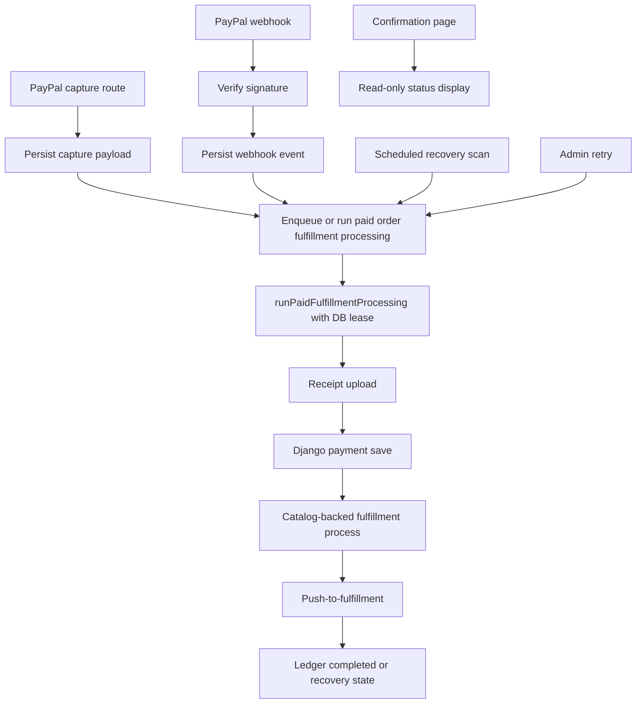

# PayPal Webhook Registration And Recovery Guide

Last updated: 2026-06-20

This guide documents the current PayPal webhook and post-payment recovery state in the repository, then defines the safe implementation path for webhook registration, sandbox/live payment-mode separation, and recovery behavior.

Related source docs:

- `PAYPAL_TX_LEDGER_GUIDE.md`
- `ADMIN_RECOVERY_TOOLING_GUIDE.md`
- `MERCHIZE_FULFILLMENT_OPS_GUIDE.md`

## Current Repository State

The repository currently has a ledger-backed PayPal flow, but post-payment processing is not triggered only by the webhook.

The current post-payment runner is:

```txt
src/lib/paypal/txLedger/runPaidFulfillmentProcessing.ts
```

Target semantic name:

```txt
src/lib/paypal/txLedger/runPaidFulfillmentProcessing.ts
```

Do not keep `runPostProcessing(orderToken)` as an alias-only fallback. Trigger callers should use `runPaidFulfillmentProcessing(orderToken)`, the real parent orchestrator that executes the paid order fulfillment stages.

That runner performs these follow-up steps after PayPal capture already exists:

1. Generate and upload the receipt.
2. Save payment details to the Django backend.
3. Build/validate the catalog-backed fulfillment payload.
4. Create/import the Merchize catalog order through Django or a server-only adapter.
5. Push the order to fulfillment.
6. Persist request/response payloads, provider identifiers, issue state, and final ledger status.

It does not authorize or capture PayPal money. Authorization and capture happen earlier in the PayPal approval/capture flow.

## Current Trigger Points

There are currently four ways post-processing can start.

### 1. Capture Route Trigger

File:

```txt
src/app/api/paypal/orders/capture/route.ts
```

Current behavior:

- Captures the authorized PayPal payment.
- Persists `capturePayload` on the ledger row.
- Schedules the real paid order fulfillment orchestrator with `after(...)`.
- If the capture payload already exists, it does not capture again. It can still resume post-processing for resumable statuses.

This means a checkout can complete even when the PayPal webhook is unavailable, as long as the Next.js server is running and the capture route finishes successfully.

### 2. PayPal Webhook Trigger

File:

```txt
src/app/api/paypal/webhooks/ledger-transaction-events/route.ts
```

Current behavior:

- Reads the raw webhook body with `req.text()`.
- Optionally verifies the PayPal signature.
- Stores webhook delivery records in `PaypalWebhookEvent`.
- Correlates events to ledger rows using PayPal order ID first, then local `orderToken` from PayPal `custom_id` or `invoice_id`.
- Updates ledger state for PayPal authorization/capture/refund events.
- On `PAYMENT.CAPTURE.COMPLETED`, schedules the real paid order fulfillment orchestrator with `after(...)`.
- Does not move `fulfillment_blocked` or `fulfillment_failed` rows backward.

### 3. Confirmation Status Route Resume

File:

```txt
src/app/api/paypal/tx-ledger/payments/[orderToken]/status/route.ts
```

Current behavior:

- Returns the current ledger status to the confirmation page.
- If the row is captured or partially processed, has no active lock, has no error, and is not completed, it schedules the real paid order fulfillment orchestrator with `after(...)`.

This is a useful local-development safety net, but it is a hidden side effect in a status endpoint. It means a customer-facing polling route can indirectly resume receipt generation, Django payment save, and fulfillment push.

### 4. Admin Retry Trigger

File:

```txt
src/app/admin/shop/paid-order-recovery/actions.ts
```

Current behavior:

- Admin retry calls the real paid order fulfillment orchestrator.
- It blocks if the row is already completed or currently locked.
- It currently acts as a broad retry path, not a fully separated "sync provider details only" action.

## Current Safety Properties

The current flow has important protections:

- PayPal capture uses a stable `paypalRequestId` based on `orderToken`.
- If a ledger row already has `capturePayload`, the capture route returns the stored capture payload instead of capturing again.
- `runPaidFulfillmentProcessing(...)` uses a DB-backed lease through `postProcessingLockId` and `postProcessingLockExpiresAt`.
- The old `runPostProcessing(...)` entrypoint should not remain as an alias-only delegate.
- Webhook events are deduped by PayPal `eventId`.
- `fulfillment_blocked` and `fulfillment_failed` rows are not automatically moved backward by webhook capture events.
- Existing Django/Merchize fulfillment responses are persisted for admin inspection.

## Current Risk Areas

### Status Route Is Not Read-Only

The status route currently reads and can schedule write-heavy post-processing. That makes the confirmation page part of the recovery system.

Risk:

- Harder to reason about production behavior.
- A normal customer page visit can trigger backend side effects.
- Webhook downtime can be hidden because the status route completes work.

Recommended direction:

- Make status-route resume explicitly configurable.
- Default it off in production.
- Keep it available for local dev or beta only if intentionally enabled.

Recommended future env var:

```txt
PAYPAL_TX_LEDGER_ENABLE_STATUS_ROUTE_RESUME=false
```

### Capture Route Is A First-Party Runner

The capture route currently schedules post-processing immediately after capture persistence.

This is not the same as browser-side processing. It is server-side and does not capture money twice. But it means the webhook is not the only completion trigger.

Decision needed:

- Keep capture-route post-processing as the intentional immediate server trigger, with webhook as backup.
- Or make webhook/scheduled recovery the only automatic post-capture trigger.

Recommended current default:

- Keep capture-route runner disabled so post-payment work stays backend-runner driven.
- Use webhook delivery plus the recovery scanner as the automatic completion paths.
- Keep the webhook registered and verified because it is still needed when the capture route fails, the user leaves, or PayPal sends later capture/refund/dispute events.

Recommended hardened production target:

- Capture route persists capture and may enqueue a durable job.
- Webhook persists provider events and may enqueue the same durable job.
- A scheduled recovery worker scans stuck rows.
- Confirmation status route is read-only.

### `after(...)` Runs In The Same Node Process

Both the capture route and webhook route use `after(...)`.

Benefit:

- The route can respond quickly instead of making PayPal or the browser wait for receipt generation, Django save, and fulfillment push.

Tradeoff:

- If the Node process exits after the response but before the `after(...)` callback finishes, the work can stop mid-run.
- The ledger must be the recovery source of truth.

Recovery paths:

- Admin retry.
- Scheduled recovery scan.
- Webhook resend from PayPal dashboard.

## PayPal Webhook Registration Model

PayPal webhook registrations are PayPal app/payment-mode specific. Deployment environment and PayPal payment mode are separate concerns: a production-deployed app can still run with `PAYPAL_PAYMENT_MODE=sandbox` while real payments are not enabled.

Use separate webhook registrations for:

- Sandbox local/dev.
- Sandbox staging if needed.
- Sandbox production-deployed testing if the deployed app is still using sandbox payments.
- Live payment mode when real payments are enabled.

Do not use a live webhook ID for sandbox transactions.

Recommended payment-mode split:

```txt
# Sandbox payment mode: local, staging, or production-deployed testing
PAYPAL_PAYMENT_MODE=sandbox
NEXT_PUBLIC_PAYPAL_PAYMENT_MODE=sandbox
NEXT_PUBLIC_PAYPAL_SANDBOX_CLIENT_ID=...
PAYPAL_SANDBOX_CLIENT_ID=...
PAYPAL_SANDBOX_CLIENT_SECRET=...
PAYPAL_SANDBOX_WEBHOOK_ID=...

# Live payment mode: real payments
PAYPAL_PAYMENT_MODE=live
NEXT_PUBLIC_PAYPAL_PAYMENT_MODE=live
NEXT_PUBLIC_PAYPAL_LIVE_CLIENT_ID=...
PAYPAL_LIVE_CLIENT_ID=...
PAYPAL_LIVE_CLIENT_SECRET=...
PAYPAL_LIVE_WEBHOOK_ID=...
```

The repository currently resolves these values in:

```txt
src/lib/paypal/serverPayPalConfig.ts
```

Resolution rules:

- `PAYPAL_PAYMENT_MODE=live` uses live credentials and live webhook ID.
- `PAYPAL_PAYMENT_MODE=sandbox` uses sandbox credentials and sandbox webhook ID.
- `NEXT_PUBLIC_PAYPAL_PAYMENT_MODE` should match `PAYPAL_PAYMENT_MODE`.
- Generic fallback env vars are intentionally not used by the current implementation.

## Domain Strategy

Use one canonical listener URL per PayPal app/payment mode. PayPal posts events to the listener URL registered under the app that created the transaction.

Live payment mode should use a stable production listener URL, for example:

```txt
https://codexchristi.shop/next-api/paypal/webhooks/ledger-transaction-events
```

If two public domains point to the same app, do not register both as PayPal webhook listeners for the same app/events unless duplicate delivery is intentional.

Reason:

- PayPal will send events to every subscribed listener.
- Duplicate listener domains add noise and operational complexity.
- Ledger idempotency helps, but the clean live-payment design is one canonical webhook endpoint.

Recommended setup:

```txt
Local dev:
ngrok HTTPS URL registered under the Sandbox app.

Staging:
stable staging HTTPS URL registered under the Sandbox app.

Production-deployed app while still using sandbox payments:
stable production HTTPS URL registered under the Sandbox app,
or ngrok only if you intentionally want sandbox webhooks to reach local dev instead.

Live payment mode:
canonical production HTTPS URL registered under the Live app.
```

Live payment mode should not rely on ngrok.

## Signature Verification

Current file:

```txt
src/app/api/paypal/webhooks/ledger-transaction-events/route.ts
```

Current behavior:

```txt
PAYPAL_WEBHOOK_SIGNATURE_VERIFICATION
```

- `required` verifies real sandbox/live webhook deliveries.
- `disabled` skips verification for simulator events or short local debugging windows.

Recommended deployed-webhook rule:

```txt
PAYPAL_WEBHOOK_SIGNATURE_VERIFICATION=required
```

Recommended local simulator/dev rule:

```txt
PAYPAL_WEBHOOK_SIGNATURE_VERIFICATION=disabled
```

Only use skipped verification for local development, webhook simulator cases, or short debugging windows.

## Event Types To Register

The current webhook handler explicitly understands these PayPal event types:

```txt
PAYMENT.AUTHORIZATION.CREATED
PAYMENT.CAPTURE.PENDING
PAYMENT.CAPTURE.COMPLETED
PAYMENT.CAPTURE.DENIED
PAYMENT.CAPTURE.REFUNDED
```

Sandbox and live payment modes can start with those event types.

Future event types likely needed:

```txt
PAYMENT.CAPTURE.REVERSED
CUSTOMER.DISPUTE.CREATED
CUSTOMER.DISPUTE.UPDATED
CUSTOMER.DISPUTE.RESOLVED
```

Do not subscribe to broad wildcard events unless the handler has a clear ignored-event strategy and operational logging.

## Target Backend Architecture

Recommended target:



The long-term rule:

- Capture route, webhook route, scheduled worker, and admin action may all request post-processing.
- `runPaidFulfillmentProcessing(...)` and the ledger lease decide whether work should actually run.
- Customer status polling should not be the main production recovery mechanism.

## Recommended Next Implementation Steps

### Step 1 - Make Trigger Policy Explicit

Add clear env flags:

```txt
PAYPAL_TX_LEDGER_ENABLE_CAPTURE_ROUTE_RUNNER=false
PAYPAL_TX_LEDGER_ENABLE_STATUS_ROUTE_RESUME=false
PAYPAL_TX_LEDGER_RECOVERY_SCANNER_ENABLED=true
PAYPAL_TX_LEDGER_RECOVERY_SCANNER_MIN_AGE_MINUTES=15
PAYPAL_TX_LEDGER_RECOVERY_SCANNER_BATCH_SIZE=5
PAYPAL_TX_LEDGER_RECOVERY_SCANNER_SECRET=...
```

Recommended behavior:

- Capture route runner disabled by default.
- Webhook runner enabled.
- Recovery scanner enabled.
- Status route resume disabled.

### Step 2 - Gate Status Route Resume

Update:

```txt
src/app/api/paypal/tx-ledger/payments/[orderToken]/status/route.ts
```

Behavior:

- Always return status.
- Only schedule `runPaidFulfillmentProcessing(...)` when `PAYPAL_TX_LEDGER_ENABLE_STATUS_ROUTE_RESUME=true`.
- Include a response field such as `recoveryResumeScheduled` only if useful for debugging.

### Step 3 - Register Sandbox Webhook

For sandbox payment mode:

1. Choose the sandbox listener target:
   - local dev through ngrok, or
   - a stable deployed HTTPS URL if the production-deployed app is still using sandbox payments.
2. Register the listener URL under the PayPal Sandbox app.

```txt
https://{ngrok-host}/next-api/paypal/webhooks/ledger-transaction-events
```

or:

```txt
https://{deployed-host}/next-api/paypal/webhooks/ledger-transaction-events
```

3. Store the generated sandbox webhook ID:

```txt
PAYPAL_SANDBOX_WEBHOOK_ID=...
```

4. Set:

```txt
PAYPAL_PAYMENT_MODE=sandbox
NEXT_PUBLIC_PAYPAL_PAYMENT_MODE=sandbox
PAYPAL_WEBHOOK_SIGNATURE_VERIFICATION=required
```

5. Use sandbox PayPal credentials and a sandbox ledger/database target.

### Step 4 - Register Live Payment Webhook

Only do this when real payments are ready:

1. Deploy the stable production listener URL.
2. Register that listener under the PayPal Live app:

```txt
https://codexchristi.shop/next-api/paypal/webhooks/ledger-transaction-events
```

3. Store the generated live webhook ID:

```txt
PAYPAL_LIVE_WEBHOOK_ID=...
```

4. Set:

```txt
PAYPAL_PAYMENT_MODE=live
NEXT_PUBLIC_PAYPAL_PAYMENT_MODE=live
PAYPAL_WEBHOOK_SIGNATURE_VERIFICATION=required
```

### Step 5 - Add Recovery Scanner

Add a scheduled recovery path:

```txt
src/app/api/jobs/paypal-tx-ledger-recovery-scan/route.ts
```

The route is protected by:

```txt
x-cron-secret: PAYPAL_TX_LEDGER_RECOVERY_SCANNER_SECRET
```

Recommended VPS cron cadence:

```txt
every 30 minutes
```

The first automatic scanner version should scan for rows stuck in:

```txt
captured
receipt_uploaded
payment_saved
```

Rules:

- Pick rows older than `PAYPAL_TX_LEDGER_RECOVERY_SCANNER_MIN_AGE_MINUTES`.
- Process at most `PAYPAL_TX_LEDGER_RECOVERY_SCANNER_BATCH_SIZE` rows.
- Process sequentially.
- Do not auto-run generic `error` rows. Show those for admin review first.
- Do not auto-run rows in `fulfillment_blocked`.
- Do not auto-run rows in `fulfillment_failed` unless the saved stage state proves the failure is in a safe, idempotent remaining stage.
- Accepted Django fulfillment-process rows should move to provider registration, external-number lookup, explicit push-to-fulfillment, status/reconciliation, not full payment-side replay.
- Respect active `postProcessingLockExpiresAt`.
- Use the same `runPaidFulfillmentProcessing(orderToken)` entrypoint only when the row is genuinely incomplete.

### Step 6 - Add Webhook Operations Visibility

Admin UI should eventually expose:

- latest webhook event
- webhook event type
- webhook delivery status
- verification failures
- ignored events
- stuck `received` events
- resend guidance from PayPal dashboard

## Acceptance Checklist

- Sandbox webhook ID is separate from live webhook ID.
- A production-deployed app can still use sandbox PayPal payment mode until real payments are ready.
- Sandbox payment mode uses sandbox credentials and `PAYPAL_SANDBOX_WEBHOOK_ID`.
- Live payment mode uses live credentials and `PAYPAL_LIVE_WEBHOOK_ID`.
- Live payment mode uses a stable production domain, not ngrok.
- Only one canonical live payment listener domain is registered for PayPal webhook delivery.
- Deployed environments have `PAYPAL_WEBHOOK_SIGNATURE_VERIFICATION=required` for real PayPal deliveries.
- Webhook events are stored once per PayPal event ID.
- Duplicate webhook deliveries do not duplicate post-processing.
- Capture route does not capture money again when `capturePayload` already exists.
- Status route resume is explicitly gated before production.
- Confirmation page success is based on ledger `completed`, not receipt availability alone.
- Accepted Django 201 fulfillment rows are not shown as "rerun full post-processing" cases.
- Stuck captured/payment-saved rows have an admin or scheduled recovery path.

## Open Questions

1. Should capture-route post-processing remain enabled in production as the immediate first-party runner, or should it only persist capture and let webhook/scheduled recovery do the rest?
2. Should status-route resume be completely removed, or kept as a local-dev-only fallback?
3. Which production domain is the canonical PayPal live payment webhook endpoint?
4. Should staging use a stable sandbox webhook URL instead of local ngrok for repeatable QA?
5. What scheduled job mechanism will run recovery scans: Vercel cron, VPS cron, a private admin endpoint, or a dedicated worker?
